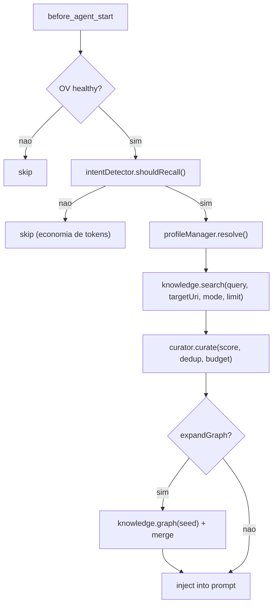
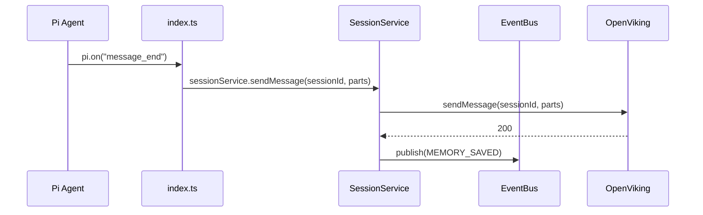
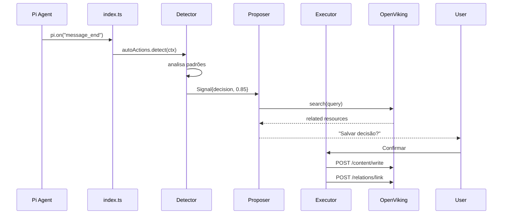

# Arquitetura do pi-openviking

> **Arquitetura Hexagonal (Ports & Adapters).**
> Domínio puro no centro. Adaptadores na periferia.
> Inversão de dependência: o núcleo não importa nada externo.

---

## Estado Atual

| Fase | Status | Artefatos |
|------|--------|-----------|
| **F1 Foundation** | ✅ Completo | ConfigSchema, Cascade, Loader, DI Container, Logger (interface + FileLogger + NullLogger), Lifecycle, PathResolver |
| **F2 Domain + Ports** | 🔶 Em progresso | `domain/common/` ✅ · `domain/errors/` ✅ · `domain/knowledge/model/` ✅ · `domain/recall/model/` ✅ · 6 port interfaces ✅ · `infrastructure/event-bus/in-memory.ts` (InMemoryEventBus) ✅ · `domain/recall/curate.ts` (curation) ✅ · Prototype deleted ✅ · Pendente: `domain/ports/` restantes (todos implementados). |
| **F3+** | ⏳ Planejado | Ver `02-PLANO.md` |

> Este documento descreve a **arquitetura alvo**. Componentes marcados como (futuro) ainda não existem.
> Para o estado atual do código, consulte a seção [6. Estrutura de Diretórios](#6-estrutura-de-diretórios).
> Para tipos compartilhados já implementados (`domain/common/`), veja [2. F2 — Ordem de Implementação](#2-f2--ordem-de-implementação).

---

## 1. Diagrama de Camadas

```mermaid
flowchart TB
    subgraph External["🌍 Mundo Externo"]
        PI["Pi Agent (MCP/CLI)"]
        OV["OpenViking Server :1933"]
        USER["Usuário (TUI)"]
    end

    subgraph Adapters["🔌 Adaptadores (Driving)"]
        direction TB
        TOOL_REGISTRY["Tool Registry\nregisterTool() → App Service"]
        CMD_REGISTRY["Command Registry\nregisterCommand() → App Service"]
        UI_HOOKS["UI Hooks\nsetStatus, autocomplete,\nnotify — registra no Pi"]
    end

    subgraph Ports["🚪 Portas (Interfaces)"]
        direction TB
        PORT_KB["KnowledgeBase\nsearch / glob / grep"]
        PORT_FS["FsStore\nread / write / list / tree / stat\nmkdir / mv / delete"]
        PORT_GRAPH["GraphStore\nlink / unlink / graph"]
        PORT_SESSION["SessionStore\ncreate / send / commit / ..."]
        PORT_CACHE["CacheStore\nget / set / invalidate"]
        PORT_LOGGER["Logger\ndebug / info / warn / error"]
        PORT_EVENTS["EventBus\npublish / subscribe"]
    end

    subgraph Domain["🧠 Domínio (3 Bounded Contexts)"]
        direction TB
        DOMAIN_KNOW["Knowledge Context\nKnowledgeItem, Resource,\nUri, SessionId"]
        DOMAIN_RECALL["Recall Context\nRecallItem, TokenBudget,\nIntentDetector, RecallCurator,\nGraphExpander"]
        DOMAIN_PROFILE["Profile Context\nProfileConfig (value object),\nProfileManager, AutoDetect"]
    end

    subgraph App["⚙️ Aplicação"]
        direction TB
        APP_SVC["Application Services\nsearch, write, session,\nrecall, backup, auto-actions"]
        APP_MW["Middleware Pipeline\nLogging (cache adiado → F3+)"]
    end

    subgraph Impl["🔌 Adaptadores (Driven)"]
        direction TB
        OV_ADAPTER["OpenVikingAdapter\nImplementa KnowledgeBase\n+ FsStore + GraphStore\n+ SessionStore"]
        OV_TRANSPORT["Transport\nHTTP + Auth + Retry + RateLimit"]
        CACHE_IMPL["CacheImpl\nInMemoryCache\n(Redis opcional)"]
        LOG_IMPL["FileLogger\nJSON lines + rotação"]
        EVENT_IMPL["InMemoryEventBus\nImplementa EventBus port"]
    end

    subgraph Infra["🏗️ Infraestrutura"]
        direction TB
        DI["DI Container\nManual (21 linhas)"]
        CONFIG["Config Cascade\ndefaults → env → file → profile"]
        LIFECYCLE["Lifecycle\ninit() / shutdown()"]
    end

    PI --> TOOL_REGISTRY
    PI -->|pi.on()| APP_SVC
    USER --> CMD_REGISTRY
    USER --> UI_HOOKS

    TOOL_REGISTRY --> APP_SVC
    CMD_REGISTRY --> APP_SVC
    UI_HOOKS --> APP_SVC

    APP_SVC --> DOMAIN_KNOW
    APP_SVC --> DOMAIN_RECALL
    APP_SVC --> DOMAIN_PROFILE
    APP_SVC -.-> APP_MW

    APP_SVC --> PORT_KB
    APP_SVC --> PORT_FS
    APP_SVC --> PORT_GRAPH
    APP_SVC --> PORT_SESSION
    APP_SVC --> PORT_CACHE
    APP_SVC --> PORT_LOGGER
    APP_SVC --> PORT_EVENTS

    OV_ADAPTER --> PORT_KB
    OV_ADAPTER --> PORT_FS
    OV_ADAPTER --> PORT_GRAPH
    OV_ADAPTER --> PORT_SESSION
    OV_ADAPTER --> OV_TRANSPORT
    OV_TRANSPORT -->|HTTP| OV

    CACHE_IMPL --> PORT_CACHE
    LOG_IMPL --> PORT_LOGGER
    EVENT_IMPL --> PORT_EVENTS

    DI --> OV_ADAPTER
    DI --> CACHE_IMPL
    DI --> LOG_IMPL
    DI --> EVENT_IMPL
    DI --> APP_SVC
    CONFIG --> DI
    LIFECYCLE --> DI
```

> **Nota sobre PiEventBridge:** não existe `pi-event-bridge.ts` como adaptador separado.
> Pi emite eventos de infra (session_start, message_end) via `pi.on()` diretamente para
> Application Services. O EventBus de domínio só transporta eventos de domínio
> (MEMORY_SAVED, INTENT_DETECTED, etc.) — ver ADR-011.
> Ver [seção 4.4](#44-event-bus--domínio-puro) para detalhes.

---

## 2. F2 — Ordem de Implementação

A ordem de criação dos artefatos de domínio segue dependências entre eles:

| Passo | Artefato | Depende |
|-------|----------|---------|
| 1 | `domain/common/` — Uri (class), SessionId (class), ContentLevel, WriteMode, SearchQuery (interface), Part (discriminated union) | — |
| 2 | `domain/errors/` — DomainError class + subtipos (NotFoundError, ConnectionError, etc.) | — |
| 3 | `domain/{knowledge,recall,profile}/model/` — value objects + aggregates | common, errors |
| 4 | `domain/ports/` — KnowledgeBase, FsStore, GraphStore, SessionStore, CacheStore, EventBus | models (tipos de retorno) |
| 5 | `infrastructure/event-bus/in-memory.ts` — InMemoryEventBus | ports/event-bus.ts |

ProfileManager (esqueleto) deferido para F7a. Em F2, Profile é apenas um value object
(`name` + `description`), já definido em `infrastructure/config/profile-schema.ts`.

---

## 3. Ports (Interfaces do Domínio)

Todas as ports ficam em `domain/ports/`. Adaptadores concretos em `adapters/driven/`.

### KnowledgeBase — busca semântica e lexical

Mapeamento OV: `POST /api/v1/search/find` (rápida), `POST /api/v1/search/search` (profunda),
`POST /api/v1/search/glob`, `POST /api/v1/search/grep`.

```typescript
interface KnowledgeBase {
  search(query: SearchQuery): Promise<SearchResult>;
  glob(pattern: string, uri?: Uri, limit?: number): Promise<GlobResult>;
  grep(pattern: string, opts?: GrepOptions): Promise<GrepResult>;
}
```

### GraphStore — navegação de relações

Mapeamento OV: `POST /api/v1/relations/link`, `DELETE /api/v1/relations/link`, `GET /api/v1/relations?uri=`.

```typescript
interface GraphStore {
  link(source: Uri, targets: Uri | Uri[], reason?: string): Promise<LinkResult>;
  unlink(source: Uri, target: Uri): Promise<void>;
  graph(uri: Uri): Promise<Relation[]>;
}
```

### SessionStore — ciclo de vida de sessão OV

Mapeamento OV: `POST /api/v1/sessions`, `POST /api/v1/sessions/{id}/messages`,
`POST /api/v1/sessions/{id}/commit`, `POST /api/v1/sessions/{id}/used`,
`GET /api/v1/tasks/{id}`, `DELETE /api/v1/sessions/{id}`.

```typescript
interface SessionStore {
  create(): Promise<SessionId>;
  sendMessage(sessionId: SessionId, role: string, content: Part[]): Promise<void>;
  commit(sessionId: SessionId): Promise<CommitResult>;
  getTaskStatus(taskId: string): Promise<TaskStatus>;
  sessionUsed(sessionId: SessionId, contexts: Uri[]): Promise<void>;
  deleteSession(sessionId: SessionId): Promise<void>;
}
```

### FsStore — operações no filesystem OV (ContentStore fundida)

Port única para ler, escrever, navegar e gerenciar o filesystem virtual do OpenViking.
ContentStore foi fundida nesta port — OV trata content e fs como o mesmo sistema.

Mapeamento OV: `POST /api/v1/content/write`, `GET /api/v1/fs/{read|abstract|overview}`,
`GET /api/v1/fs/ls`, `GET /api/v1/fs/tree`, `GET /api/v1/fs/stat`,
`POST /api/v1/fs/mkdir`, `POST /api/v1/fs/mv`, `DELETE /api/v1/fs`.

```typescript
interface FsStore {
  read(uri: Uri, level?: ContentLevel): Promise<Content>;
  write(uri: Uri, content: string, mode?: WriteMode): Promise<WriteResult>;
  list(uri: Uri, recursive?: boolean): Promise<FsEntry[]>;
  tree(uri: Uri): Promise<FsEntry[]>;
  stat(uri: Uri): Promise<FsEntry>;
  mkdir(uri: Uri): Promise<void>;
  mv(from: Uri, to: Uri): Promise<void>;
  delete(uri: Uri, recursive?: boolean): Promise<void>;
}
```

> `write()` não expõe `wait` no domínio — espera síncrona é detalhe de transporte OV,
> resolvido no adapter (F3) via timeout padrão. Domínio não sabe de async processing.

**Tipos de suporte (definidos em `domain/common/`):**

```typescript
// domain/common/content-level.ts
type ContentLevel = "abstract" | "overview" | "read";

// domain/common/write-mode.ts
type WriteMode = "replace" | "append" | "create";

// domain/common/search-query.ts
type SearchMode = "auto" | "fast" | "deep";

interface SearchQuery {
  query: string;
  limit?: number;
  mode?: SearchMode;
  targetUri?: Uri;
  sessionId?: SessionId;
}

// domain/common/part.ts
interface TextPart { type: "text"; text: string }
interface ToolPart {
  type: "tool";
  toolId: string; toolName: string;
  toolInput: Record<string, unknown>;
  toolOutput: string; toolStatus: string;
  toolOutputTruncated: boolean;
  toolUri: string; skillUri: string;
  durationMs: number | null;
  promptTokens: number | null;
  completionTokens: number | null;
  toolOutputRef: string;
}
interface ContextPart { type: "context"; uri: string; contextType: "memory" | "resource" | "skill"; abstract: string }
type Part = TextPart | ToolPart | ContextPart;
```

> **Nota:** `ResourceKind` foi removido — escrita de conteúdo textual é via `write()`,
> adição de resources via `POST /api/v1/resources` (adaptador OV, não port).
> OV v3 não possui endpoint `reindex`. `write()` sempre atualiza semântica/vectors automaticamente.

> `SearchQuery` e `Part` vivem em `domain/common/` por serem consumidos por múltiplas ports
e adaptadores. Não são private de port nenhuma.

### CacheStore — cache de operações repetidas

```typescript
interface CacheStore {
  get(key: string): Promise<unknown | undefined>;
  set(key: string, value: unknown, ttl?: number): Promise<void>;
  invalidate(pattern: string): Promise<void>;
}
```

### Logger — logging estruturado

```typescript
type LogLevel = "debug" | "info" | "warn" | "error";

interface Logger {
  info(msg: string, ctx?: Record<string, unknown>): void;
  warn(msg: string, ctx?: Record<string, unknown>): void;
  error(msg: string, ctx?: Record<string, unknown>): void;
  debug(msg: string, ctx?: Record<string, unknown>): void;
  isEnabled(level: LogLevel): boolean;
}
```

### EventBus — eventos de domínio entre bounded contexts (ADR-011)

```typescript
type DomainEvent =
  | { type: 'MEMORY_SAVED'; uri: string; source: string }
  | { type: 'RELATION_LINKED'; source: string; target: string; predicate: string }
  | { type: 'INTENT_DETECTED'; category: string; confidence: number }
  | { type: 'RECALL_EXECUTED'; itemsCount: number; durationMs: number }
  | { type: 'BUDGET_EXCEEDED'; budget: number; attempted: number };

interface EventBus {
  publish(event: DomainEvent): void;
  subscribe(type: string, handler: (event: DomainEvent) => void): () => void;
}
```

> **Eventos excluídos (não são de domínio):**
> - `PROFILE_CHANGED` — Profile é value object (substituído, não mutado). Mudanças de config são notificação de infra, não evento de domínio.
> - `ERROR` — não é conceito de domínio. Erros são diagnóstico.
> - `SESSION_STARTED`, `MESSAGE_PROCESSED` — infra. Tratados por `pi.on()` diretamente.
>   (Per ADR-011 e ADR-008 async init.)
```

---

## 4. Design Patterns

### 4.1 Command Pattern — Toda ação é um comando

```typescript
interface Command<TInput, TOutput> {
  execute(input: TInput): Promise<TOutput>;
}

class SearchKnowledgeCommand implements Command<SearchInput, SearchOutput> {
  constructor(
    private knowledge: KnowledgeBase,
    private intentDetector: IntentDetector,
    private curator: RecallCurator,
  ) {}

  async execute(input: SearchInput): Promise<SearchOutput> {
    if (!this.intentDetector.shouldRecall(input.query)) {
      return { items: [], total: 0 };
    }
    const results = await this.knowledge.search(input.toQuery());
    return {
      items: this.curator.curate(results, input.query),
      total: results.total,
    };
  }
}
```

### 4.2 Chain of Responsibility — Intent Detection

```
ContinuationHandler → ComplexQueryHandler → SimpleQueryHandler → LearnedRejectionHandler

Cada handler:
  1. Tenta classificar o prompt
  2. Se confidence >= threshold, retorna
  3. Se não, passa para o próximo
  4. Se nenhum match, default conservador (recall off)
```

### 4.3 Middleware Pipeline — Cross-cutting concerns

```
Request → LoggingMiddleware → Handler → Response

# Cache middleware: adiado. Implementar após OV adapter (F3+).
```

### 4.4 Event Bus — Domínio puro

Domain events carregam mudanças de estado com significado de negócio entre bounded contexts.
Eventos de infra (SESSION_STARTED, MESSAGE_PROCESSED) ficam fora — entram via `pi.on()` direto.

```
# Eventos de domínio cruzam contexts via EventBus
RecallService.publish(RECALL_EXECUTED) → ProfileAutoDetect (ajusta auto-detect)
                                        → Logger (métrica)

# Eventos de infra: pi.on() → Application Service direto (sem EventBus)
pi.on("session_start",   (e, ctx) => sessionService.sync(ctx))
pi.on("message_end",     (e, ctx) => autoRecall.maybeRecall(ctx))

# Não existe PiEventBridge separado — o index.ts registra os handlers.
```

---

## 5. Fluxos Principais

### 5.1 Auto-Recall



### 5.2 Session Sync

Evento `message_end` chega via `pi.on()` e chama SessionService direto.
EventBus de domínio não transporta eventos de infra.



### 5.3 Auto-Action (Propositivo) — (futuro, F8)

O gatilho vem de `pi.on("message_end")`, não do EventBus de domínio.



---

## 6. Estrutura de Diretórios

```
src/
├── domain/                    # Pure TS. Sem imports externos.
│   ├── common/                # ✅ Shared kernel: Uri, SessionId, ContentLevel, WriteMode, SearchQuery, Part
│   ├── knowledge/             # (futuro F2) Contexto: armazenamento e busca
│   │   ├── model/             # ✅ KnowledgeItem, ResourceItem, SkillItem, SearchResult, Relation
│   │   └── service/           # (futuro) SemanticSearch
│   ├── recall/                # (futuro F2/F4) Contexto: detecção e curadoria
│   │   ├── model/             # RecallItem, TokenBudget
│   │   ├── intent/            # Chain of Responsibility handlers + IntentDetector
│   │   └── curator/           # Scorers + RecallCurator + GraphExpander
│   ├── profile/               # (futuro F7) Contexto: perfis de comportamento
│   │   ├── model/             # ProfileConfig, AutoDetectRule
│   │   └── service/           # ProfileManager, ProfileResolver, AutoDetect
│   ├── ports/                 # ✅ Interfaces planas (todas implementadas)
│   │   ├── logger.ts          # ✅ Logger
│   │   ├── knowledge-base.ts  # ✅ KnowledgeBase + GlobResult, GrepOptions, GrepResult
│   │   ├── fs-store.ts        # ✅ FsStore + Content, WriteResult, FsEntry
│   │   ├── graph-store.ts     # ✅ GraphStore + LinkResult
│   │   ├── session-store.ts   # ✅ SessionStore + CommitResult, TaskStatus
│   │   ├── cache-store.ts     # ✅ CacheStore
│   │   └── event-bus.ts       # ✅ EventBus + DomainEvent, EventHandler
│   └── errors/                # ✅ DomainError, NotFoundError, ConnectionError, ValidationError
│
├── application/               # (futuro F4) Casos de uso
│   ├── services/              # search, write, session, recall, backup, auto-actions
│   └── middleware/            # Pipeline + middlewares
│
├── adapters/
│   ├── driving/pi/            # (futuro F5) Callbacks registrados no Pi
│   │   ├── tool-registry.ts   # registerTool()
│   │   ├── command-registry.ts # registerCommand()
│   │   ├── status-bar.ts       # ctx.ui.setStatus()
│   │   └── autocomplete.ts     # ctx.ui.addAutocompleteProvider()
│   └── driven/
│       ├── openviking/        # (futuro F3) OV Adapter + Transport + Mappers
│       ├── cache/             # (futuro F3+) InMemoryCache / RedisCache
│       └── logger/
│           ├── file-logger.ts # ✅ FileLogger (JSON lines + rotação)
│           └── null-logger.ts # ✅ NullLogger (testes/silent mode)
│
├── infrastructure/
│   ├── config/
│   │   ├── schema.ts          # ✅ ConfigSchema raiz (Zod)
│   │   ├── logger-schema.ts   # ✅ LoggerConfigSchema
│   │   ├── cascade.ts         # ✅ Config Cascade: defaults → env → file → profile
│   │   ├── loader.ts          # ✅ Leitor .pi/settings.json
│   │   └── profile-schema.ts  # ✅ ProfileSchema (só name+description em F1)
│   ├── di/
│   │   └── container.ts       # ✅ DI Container manual (21 linhas)
│   ├── event-bus/             # ✅ InMemoryEventBus (publish/subscribe, error isolation, event log)
│   ├── lifecycle.ts           # ✅ init() + shutdown()
│   └── path-resolver.ts       # ✅ PathResolver utilitário
│
├── _legacy/                   # Código original (referência, manter até F3)
├── index.ts                   # ✅ Entry point: pi.on("session_start") → init()
```

**Legenda:** ✅ existe agora | (futuro) ainda não implementado

> F2 — domain/common/ (#47), domain/errors/ + knowledge/recall models (#48), 6 port interfaces (#49) implementados 2026-05-27.

---

## 7. Princípios Arquiteturais

1. **Domain pure** — Núcleo não importa Pi, OV, HTTP, nada externo
2. **Ports > Implementations** — Interfaces primeiro, implements depois
3. **Event-driven** — Reações desacopladas via EventBus
4. **Autonomia progressiva** — off → propose → auto
5. **Silent by default** — Nunca pergunte o que pode ser inferido
6. **Graceful degradation** — OV offline não quebra o Pi
7. **Pipeline de middlewares** — Cross-cutting concerns empilháveis
8. **Cascading config** — Default → env → file → profile → inline
