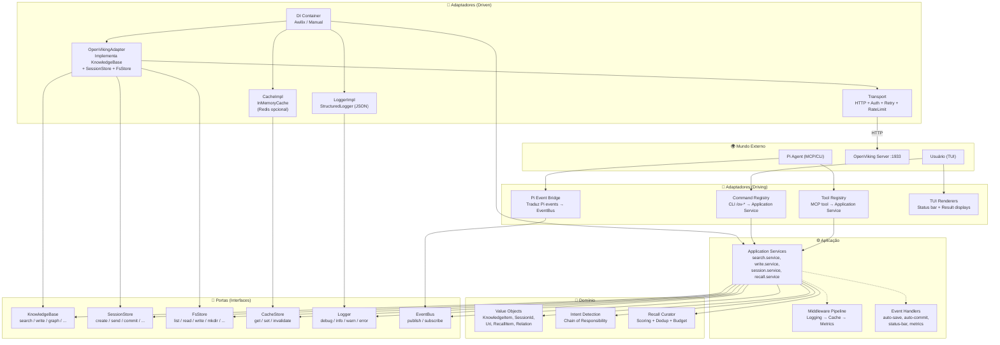
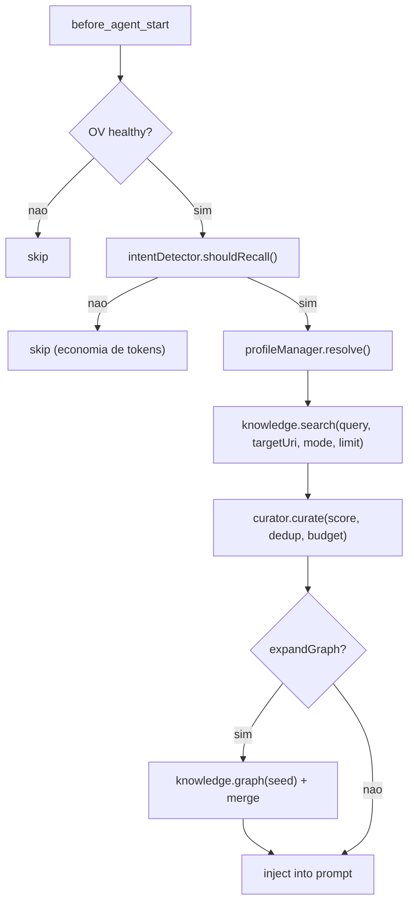
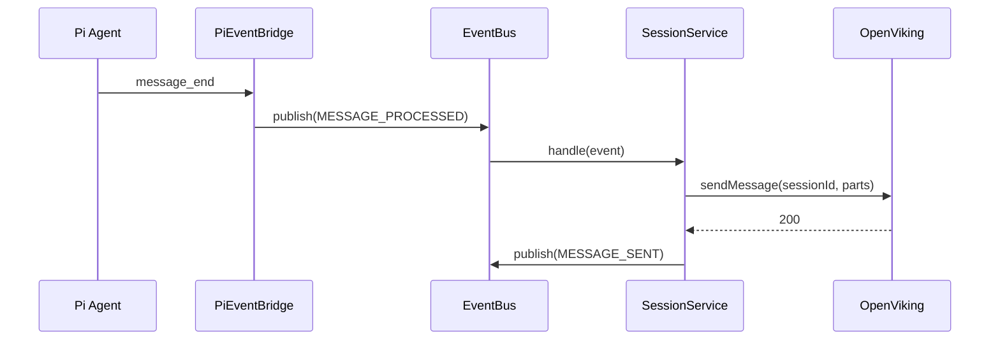
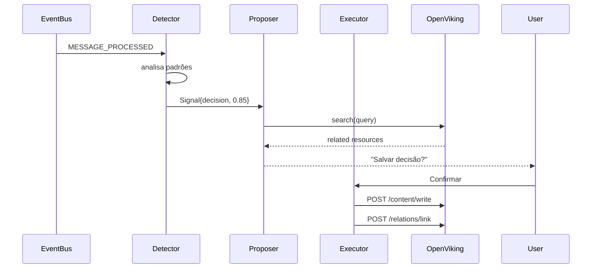

# Arquitetura do pi-openviking

> **Arquitetura Hexagonal (Ports & Adapters).**
> Domínio puro no centro. Adaptadores na periferia.
> Inversão de dependência: o núcleo não importa nada externo.

---

## 1. Diagrama de Camadas



---

## 2. Ports (Interfaces do Domínio)

### KnowledgeBase

```typescript
interface KnowledgeBase {
  search(query: SearchQuery): Promise<SearchResult>;
  glob(pattern: string, limit?: number): Promise<GlobResult>;
  grep(pattern: string, opts?: GrepOptions): Promise<GrepResult>;
  write(uri: Uri, content: Content): Promise<WriteResult>;
  download(uri: Uri): Promise<Buffer>;
  reindex(uri: Uri, recursive?: boolean): Promise<TaskRef>;
  // Grafo
  link(source: Uri, target: Uri, predicate?: string): Promise<LinkResult>;
  unlink(source: Uri, target: Uri): Promise<void>;
  graph(uri: Uri, depth?: number): Promise<GraphResult>;
}
```

### SessionStore

```typescript
interface SessionStore {
  create(): Promise<SessionId>;
  sendMessage(sessionId: SessionId, role: string, content: Part[]): Promise<void>;
  commit(sessionId: SessionId): Promise<CommitResult>;
  getTaskStatus(taskId: string): Promise<TaskStatus>;
  sessionUsed(sessionId: SessionId, contexts: Uri[]): Promise<void>;
}
```

### FsStore

```typescript
interface FsStore {
  read(uri: Uri, level?: ContentLevel): Promise<Content>;
  list(uri: Uri, recursive?: boolean): Promise<FsEntry[]>;
  tree(uri: Uri): Promise<FsEntry[]>;
  stat(uri: Uri): Promise<FsEntry>;
  mkdir(uri: Uri): Promise<void>;
  mv(from: Uri, to: Uri): Promise<void>;
}
```

### EventBus

```typescript
type DomainEvent =
  | { type: 'SESSION_STARTED'; sessionId: string; cwd: string }
  | { type: 'SESSION_ENDED'; sessionId: string }
  | { type: 'MESSAGE_PROCESSED'; sessionId: string; role: string }
  | { type: 'MEMORY_SAVED'; uri: string }
  | { type: 'INTENT_DETECTED'; category: string; confidence: number }
  | { type: 'RECALL_EXECUTED'; itemsCount: number; durationMs: number }
  | { type: 'ERROR'; source: string; error: string };

interface EventBus {
  publish(event: DomainEvent): void;
  subscribe(type: string, handler: Function): () => void;
}
```

---

## 3. Design Patterns

### 3.1 Command Pattern — Toda ação é um comando

```typescript
interface Command<TInput, TOutput> {
  execute(input: TInput): Promise<TOutput>;
}

class SearchKnowledgeCommand implements Command<SearchInput, SearchOutput> {
  constructor(
    private knowledge: KnowledgeBase,
    private intentDetector: IntentDetector,
    private curator: RecallCurator,
  ) {}

  async execute(input: SearchInput): Promise<SearchOutput> {
    if (!this.intentDetector.shouldRecall(input.query)) {
      return { items: [], total: 0 };
    }
    const results = await this.knowledge.search(input.toQuery());
    return {
      items: this.curator.curate(results, input.query),
      total: results.total,
    };
  }
}
```

### 3.2 Chain of Responsibility — Intent Detection

```
ContinuationHandler → ComplexQueryHandler → SimpleQueryHandler → LearnedRejectionHandler

Cada handler:
  1. Tenta classificar o prompt
  2. Se confidence >= threshold, retorna
  3. Se não, passa para o próximo
  4. Se nenhum match, default conservador (recall off)
```

### 3.3 Middleware Pipeline — Cross-cutting concerns

```
Request → LoggingMiddleware → CacheMiddleware → MetricsMiddleware → Handler → Response
                                    │
                           CacheStore (get/set)
```

### 3.4 Event Bus — Desacopla reações

```
PiEventBridge → publish(SESSION_STARTED) → AutoCommitHandler
                                          → StatusBarHandler
                                          → ProfileDetectHandler
```

---

## 4. Fluxos Principais

### 4.1 Auto-Recall



### 4.2 Session Sync



### 4.3 Auto-Action (Propositivo)



---

## 5. Estrutura de Diretórios

```
src/
├── domain/                    # Pure TS. Sem imports externos.
│   ├── entities/              # KnowledgeItem, SessionId, Uri, RecallItem
│   ├── ports/                 # KnowledgeBase, SessionStore, FsStore, EventBus
│   ├── intent/                # Chain of Responsibility handlers
│   ├── curator/               # Scoring, dedup, budget trim
│   └── errors/                # DomainError hierarchy
│
├── application/               # Casos de uso
│   ├── services/              # search, write, session, recall, backup
│   ├── commands/              # Command handlers
│   ├── middleware/            # Pipeline + middlewares
│   └── event-handlers/        # Reações a DomainEvents
│
├── adapters/
│   ├── driving/               # Entram no sistema
│   │   ├── pi/                # PiEventBridge, ToolRegistry, CommandRegistry
│   │   └── tui/               # Renderers
│   └── driven/                # Saem do sistema
│       ├── openviking/        # Adapter + Transport + Mappers
│       ├── cache/             # InMemoryCache / RedisCache
│       ├── config/            # Zod schema + loader
│       └── logger/            # StructuredLogger
│
├── infrastructure/            # DI container, lifecycle
│   └── di/                    # Container + modules
│
├── _legacy/                   # Código original (referência)
├── index.ts                   # Entry point
└── bootstrap.ts               # Startup wiring
```

---

## 6. Princípios Arquiteturais

1. **Domain pure** — Núcleo não importa Pi, OV, HTTP, nada externo
2. **Ports > Implementations** — Interfaces primeiro, implements depois
3. **Event-driven** — Reações desacopladas via EventBus
4. **Autonomia progressiva** — off → propose → auto
5. **Silent by default** — Nunca pergunte o que pode ser inferido
6. **Graceful degradation** — OV offline não quebra o Pi
7. **Pipeline de middlewares** — Cross-cutting concerns empilháveis
8. **Cascading config** — Default → env → file → profile → inline
