# Plano de Implementação — 8 Fases

> Rewrite do zero. Código legado (`src/_legacy/`) removido em F3 (2026-05-27).
> Cada fase funcional + testada antes de avançar.

---

## Fases

### Timeline

```
        ┌───── F1: Foundation (11d) ──────────────────────┐
        │                                                  │
        ▼                                                  │
   ┌─ F2: Domain + Ports (9d) ─────────────────────────┐  │
   │                                                     │  │
   ▼                                                     │  │
┌─ F3: OV Adapter (12d) ──────────────────────────┐     │  │
│                                                    │     │  │
▼                                                    │     │  │
┌─ F4: Operations (14d) ───────────────────────┐    │     │  │
│                                                │    │     │  │
▼                                                │    │     │  │
┌─ F5: Tools + Commands (15d) ─────────────┐    │    │     │  │
│                                            │    │    │     │  │
▼                                            │    │    │     │  │
┌─ F6: Auto-Recall + Session (15d) ─────┐   │    │    │     │  │
│                                         │   │    │    │     │  │
▼                                         │   │    │    │     │  │
┌─ F7a: Profiles Essential (5d) ──┐     │   │    │    │     │  │
│  F7b: Profiles Expansion (7d) ──┤     │   │    │    │     │  │
│                                  │     │   │    │    │     │  │
▼                                  │     │   │    │    │     │  │
┌─ F8: Features (19d) ───────────┐    │     │   │    │    │     │  │
│                                  │    │     │   │    │    │     │  │
▼                                  ▼    ▼     ▼   ▼    ▼    ▼     ▼  ▼
┌──────────────────────────────────────────────────────────────────────┐
│                        Release v1.0                                  │
└──────────────────────────────────────────────────────────────────────┘
```

### Calendário

| Fase | Início | Término | Dias | Marcos |
|------|--------|---------|------|--------|
| **F1** Foundation | 02/jun | 16/jun | 11 | Config, DI, Logger, Profiles |
| **F2** Domain + Ports | 16/jun | 26/jun | 9 | Ports definidas, EventBus |
| **F3** OV Adapter | 26/jun | 10/jul | 12 | Transport, Adapter, Mappers |
| F4 | Operations | 10/jul | 28/jul | 14 | Services, Curator, Recall Toggle |
| **F5** Tools + Commands | 28/jul | 18/ago | 15 | Primeiro momento funcional |
| **F6** Auto-Recall + Session | 18/ago | 05/set | 15 | Memória persistente operacional |
| **F7a** Profiles Essential | 05/set | 12/set | 5 | Schema estendido, ProfileManager, integração recall |
| **F7b** Profiles Expansion | 12/set | 19/set | 7 | Auto-detect, command, integração auto-actions |
| **F8** Features | 19/set | 14/out | 19 | Plugin completo + Release

---

## Detalhamento por Fase

### F1 — Foundation (11 dias)

**Objetivo:** Infraestrutura base. Nada de OV ainda. Tudo testável isoladamente.

| Tarefa | Artefato | Depende | Descrição |
|--------|----------|---------|-----------|
| F1.1 | `infrastructure/config/schema.ts` | — | Schema Zod de toda config (logger, profile, autoRecall, etc) |
| F1.2 | `infrastructure/config/cascade.ts` | F1.1 | Loader: defaults + env vars + .pi/settings.json → merge + validate |
| F1.3 | `infrastructure/config/loader.ts` | — | Leitor de .pi/settings.json |
| F1.4 | `infrastructure/di/container.ts` | — | DI container (Awilix ou implementação própria) |
| F1.5 | `infrastructure/di/modules/*.ts` | F1.4 | Módulos: core, ov, cache, intent |
| F1.6 | `adapters/driven/logger/structured.ts` | — | Logger JSON estruturado com níveis + rotação |
| F1.7 | `infrastructure/config/profile-schema.ts` | F1.1 | Schema Zod de profile + 4 builtins |
| — | — | — | **F1.8 cancelado.** ProfileManager esqueleto deferido para F2/F7a. Profile = value object (não aggregate root). Ver `docs/DEFERRED.md`. |
| — | Testes | Tudo | Cobertura ≥90% |

**Milestone:** Config carregada e validada. DI montado. Logger operacional.
Profiles registrados. Tudo testado sem OV.

### F2 — Domain + Ports (9 dias)

**Objetivo:** Núcleo do domínio puro. Sem dependência externa. Testável.

**Ordem de implementação (dependente da anterior):**

| Passo | Tarefa | Artefato | Descrição |
|-------|--------|----------|-----------|
| 1 | F2.0a | `domain/common/{uri,session-id,content-level,write-mode,search-query,part,index}.ts` | ✅ Shared kernel: Uri (class), SessionId (class), ContentLevel, WriteMode, SearchQuery (interface), Part (discriminated union) |
| 2 | F2.0b | `domain/errors/{domain-error,not-found-error,connection-error,validation-error,index}.ts` | ✅ DomainError, NotFoundError, ConnectionError, ValidationError |
| 3 | F2.1 | `domain/{knowledge,recall}/model/*.ts` | ✅ KnowledgeItem, ResourceItem, SkillItem, SearchResult, Relation, RecallItem, TokenBudget |
| 4 | F2.2 | `domain/ports/knowledge-base.ts` | ✅ KnowledgeBase + GlobResult, GrepOptions, GrepResult |
| 5 | F2.3 | `domain/ports/session-store.ts` | ✅ SessionStore + CommitResult, TaskStatus |
| 6 | F2.4 | `domain/ports/fs-store.ts` | ✅ FsStore (read + write + list + tree + stat + mkdir + mv + delete; **sem wait na port**) + Content, WriteResult, FsEntry |
| 7 | F2.5 | `domain/ports/event-bus.ts` | ✅ EventBus + DomainEvent types (ADR-011) + EventHandler |
| 8 | F2.6 | `domain/ports/cache-store.ts` | ✅ CacheStore |
| 9 | F2.7 | `domain/ports/logger.ts` | ✅ Logger (já existia) |
| 10 | F2.8 | `domain/ports/graph-store.ts` | ✅ GraphStore + LinkResult |
| 11 | F2.9 | `infrastructure/event-bus/in-memory.ts` | ✅ InMemoryEventBus (publish/subscribe/unsubscribe, error isolation, event log) |
| 12 | F2.10 | `domain/recall/curate.ts` | ✅ Curation function: merge → dedup → score-sort → threshold → topN → budget trim |
| — | — | Testes | Cobertura ≥90% |

**Decisões de design:**
- `ContentStore` foi fundida em `FsStore` — OV trata content e fs como o mesmo sistema.
  FsStore tem `write()`, `delete()`, `read()` + navegação. **Sem `reindex()` na port** — write() sempre refresca semântica/vectors automaticamente.
  OV tem `POST /api/v1/content/reindex` (admin, mode: vectors_only | full) para manutenção, mas não faz parte da FsStore — uso normal não precisa chamar reindex.
- `Uri` e `SessionId` são **classes** (value objects com validação), não type aliases.
- `FindQuery` e `SearchRequest` são interfaces, não classes — objetos de dados simples.
- `Part` é união discriminada de interfaces `TextPart | ToolPart | ContextPart`.
- `ContentLevel`, `WriteMode` são type aliases (string literal union).
- **`SearchMode` removido.** OV tem dois endpoints de busca distintos:
  - `find()` → `POST /api/v1/search/find` (sem sessão, sem intent analysis)
  - `search()` → `POST /api/v1/search/search` (com sessão + intent analysis)
  `KnowledgeBase` expõe ambos como métodos separados, não mode flag.
- ProfileManager (esqueleto) deferido para F7a. Profile é value object (`name` + `description`) em F2.

**Mapeamento OV v3 confirmado (2026-05):**
- FsStore.read → `GET /api/v1/content/{read|abstract|overview}?uri=&offset=&limit=` (offset/limit para paginação de arquivos grandes)
- FsStore.write → `POST /api/v1/content/write` (mode: replace|append|create)
- FsStore.delete → `DELETE /api/v1/fs?uri=&recursive=`
- KnowledgeBase.search → `POST /api/v1/search/find` ou `/search/search`
- KnowledgeBase.glob → `POST /api/v1/search/glob` (params: pattern, uri (root scope), node_limit)
- KnowledgeBase.grep → `POST /api/v1/search/grep` (params: uri, pattern, case_insensitive, exclude_uri, level_limit, node_limit)
- GraphStore.link → `POST /api/v1/relations/link`
- GraphStore.unlink → `DELETE /api/v1/relations/link`
- GraphStore.graph → `GET /api/v1/relations?uri=`
- SessionStore.create → `POST /api/v1/sessions`
- SessionStore.sendMessage → `POST /api/v1/sessions/{id}/messages`
- SessionStore.commit → `POST /api/v1/sessions/{id}/commit` (aceita `keepRecentCount` → `keep_recent_count`)
- SessionStore.sessionUsed → `POST /api/v1/sessions/{id}/used`
- SessionStore.sendMessages (batch) → `POST /api/v1/sessions/{id}/messages/batch` (max 100)
- SessionStore.getTaskStatus → `GET /api/v1/tasks/{id}`
- SessionStore.listTasks → `GET /api/v1/tasks` (filtros: task_type, status, resource_id, limit)

**Milestone:** Domínio puro definido. Ports estabelecidas. Nada importa infra real.

### F3 — OV Adapter (12 dias)

**Objetivo:** Implementar as Ports contra o OV real. Testável com mock server.

| Tarefa | Artefato | Depende | Status |
|--------|----------|---------|--------|
| F3.1 | `adapters/driven/openviking/transport.ts` | F1.1 (config) | ✅ |
| F3.2a | `adapters/driven/openviking/mappers/error-mapper.ts` | F2 (domain types) | ✅ |
| F3.2b | `adapters/driven/openviking/mappers/content-mapper.ts` | F2 (domain types) | ✅ |
| F3.2c | `adapters/driven/openviking/fs-store.ts` (read) | F3.1 + F3.2b | ✅ |
| F3.2d | `adapters/driven/openviking/mappers/fs-mapper.ts` | F2 (domain types) | ✅ |
| F3.2e | `adapters/driven/openviking/mappers/search-mapper.ts` | F2 (domain types) | ✅ |
| F3.2f | `adapters/driven/openviking/mappers/session-mapper.ts` | F2 (domain types) | ✅ |
| F3.2g | `adapters/driven/openviking/mappers/relation-mapper.ts` | F2 (domain types) | ✅ |
| F3.3a | `adapters/driven/openviking/fs-store.ts` (write + list + tree + stat + mkdir + mv + delete) | F3.1 + F3.2d | ✅ |
| F3.3b | `adapters/driven/openviking/knowledge-base.ts` (find + search + glob + grep) | F3.1 + F3.2e | ✅ |
| F3.3c | `adapters/driven/openviking/session-store.ts` (create+message+commit+tasks+lifecycle) | F3.1 + F3.2f | ✅ |
| F3.3d | `adapters/driven/openviking/graph-store.ts` (link+unlink+graph) | F3.1 + F3.2g | ✅ |
| F3.3e | `adapters/driven/openviking/adapter.ts` (factory) | F3.1 + F3.2 | ✅ |
| F3.4 | DI wiring (`lifecycle.ts` regista 4 ports) + smoke test (mock OV in-process) | F3.3 | ✅ |
| **F3** | **Milestone completo** | — | ✅ |

**Milestone:** Ports implementadas. Testado contra OV real e mock.

**Nota:** O teste de F3.1 usa servidor HTTP in-process (Node http), não Docker — cada teste sobe e derruba o mock sem dependência externa.

### F4 — Operations (14 dias)

**Objetivo:** Domain logic pura (RecallCurator, scorers) + serviços com estado ou orquestração real (RecallService, SessionService).
Wrappers finos sem lógica (SearchService, WriteService) ficam para F5.

**Ordem de implementação (domain logic → services):**

| Passo | Tarefa | Artefato | Descrição |
|-------|--------|----------|-----------|
| 1 | F4.1a | `domain/recall/curate.ts` (scorers) | ✅ `Scorer` type + `relevanceScorer` (keyword overlap, max +0.5) + `temporalScorer` (exponential decay, half-life 7d, max +0.5). Scorers live in curate.ts alongside pipeline. 23 tests. |
| 2 | F4.1b | `src/domain/recall/curate.ts` (expandir) | ✅ `CurateOpts` ganhou `scorers?: Scorer[]` + `query?: string`. `CuratedItem` ganhou `modTime?`. `curate()` aplica scorers após base sort, soma scores, re-ordena. Backward-compatible. |
| 3 | F4.2 | ~~`domain/recall/intent/`~~ **Eliminado** | Intent Detection removido. Recall é toggle command. searchMode vem do RecallConfig. |
| 4 | F4.3 | ✅ `domain/recall/recall-curator.ts` | `RecallCurator` wrapper sobre `curate()`. Lê `topN`, `scoreThreshold`, `maxTokens` do config, chama `curate()` com scorers, emite log. GraphExpander = optional. 6 tests. |
| 5 | F4.4 | `infrastructure/config/schema.ts` (expandir) | ✅ `RecallConfigSchema` adicionado: `targetUri` (string?), `topN` (5), `scoreThreshold` (0.5), `maxTokens` (4000), `expandGraph` (false), `searchMode` ('find'|'search'). Env vars: OV_TOP_N, OV_SCORE_THRESHOLD, OV_TARGET_URI, OV_EXPAND_GRAPH, OV_SEARCH_MODE. 36 tests config/. |
| 6 | F4.5 | ✅ `domain/recall/recall-service.ts` | RecallService: orquestra toggle check → `kb.find()`/`kb.search()` (by searchMode) → `curator.curate()` → `RecallResult { items, tokens, formatted, total }`. Constructor: `(kb, curator, config, logger, enabled)`. ConnectionError → empty + warn. 5 tests. |
| 7 | F4.6 | `domain/services/session-service.ts` ✅ | Dono da sessão ativa: `getActive()`, `createAndSet()`. `commit(id)` retorna `{ taskId }` imediato. `waitForCommit(taskId, timeout?)` opcional. |
| 8 | F4.7 | ✅ `infrastructure/lifecycle.ts` + `lifecycle.test.ts` | Lifecycle wiring: `init()` cria e registra RecallCurator (sem scorers), SessionService (wired to SessionStore), RecallService (wired to KB + curator, enabled=true). 3 singletons F4 → total 10 no container. Smoke test: resolve + invoke cada serviço. 16 lifecycle tests. |
| — | Testes | Unit com port mocks (vitest). Cobertura ≥90%. |

**Decisões de design (grill 2026-05-28, ver CONTEXT.md):**

**RecallCurator vs curate() existente:**
RecallCurator é wrapper, não rewrite. Classe injeta config + scorers, chama `curate()` pura, orquestra expandGraph opcional. Scorers (`Scorer[]`) estendem scoring interno — não substituem.

**F4 reordenado:**
Domain logic primeiro (scorers → curate() → RecallCurator), depois services (RecallService, SessionService). Services dependem de domain logic.

**RecallService retorna dados puros:**
`{ items, tokens, formatted }`. Caller (F6) faz inject no prompt. RecallService não sabe de Pi.

**Recall toggle:**
Recall é controlado por toggle command (`/ov recall on|off`). searchMode vem do `RecallConfig` (default `'find'`), overridable via profile. Sem intent detection.

**Graceful degradation:**
RecallService catcha ConnectionError → log warn + retorno vazio. Demais services propagam ConnectionError.

**SessionService dono da sessão ativa:**
`getActive(): SessionId | null`, `createAndSet(): SessionId`. Estado não vaza pra index.ts.

**Commit async:**
`commit(sessionId)` retorna imediato com `taskId`. `waitForCommit(taskId, timeout?)` opcional — F6 chama ambos, F5 tools podem expor taskId ao usuário.

**Middleware pipeline (F5):**
F4 services não sabem de middleware. F5 tool handler chama `pipeline.execute(() => service.method())`.

**lifecycle.ts:**
`init()` único — F4 services resolvidos e registrados no mesmo lugar que F1-F3. Sem lifecycle separado.

**Testes:**
Unit tests com port mocks. Sem integration tests upfront. F5 adiciona integration se necessário.

**Milestone:** Domain logic (scorers, RecallCurator) + RecallService + SessionService + RecallConfig + lifecycle wiring implementados e testados (≥90%). F4 ✅ completo.

### F5 — Tools + Commands (15 dias)

**Objetivo:** Conectar o domínio ao Pi. Primeiro momento em que algo roda.

| Tarefa | Artefato | Descrição | Status |
|--------|----------|-----------|--------|
| **F5.1** | `domain/pipeline/pipeline.ts` + `logging-middleware.ts` | Pipeline genérico `Pipeline<T>` + LoggingMiddleware. 7 tests. | ✅ |
| **F5.2** | `domain/services/search-service.ts` | SearchService: thin wrapper delegating find/search/glob/grep ao KB. Mode routing. 7 tests. | ✅ |
| **F5.3** | `adapters/driver/pi-tools/ov-{search,glob,grep}.ts` | 3 tools registradas via `pi.registerTool()`, cada uma chama `pipeline.execute()`. TypeBox schemas. 11 tests. | ✅ |
| **F5.4** | `src/index.ts` + `infrastructure/lifecycle.ts` | Entry point: `session_start` → `init()` → resolve KB → create pipelines/services → register tools. 11 singletons. | ✅ |
| **F5.5** | `adapters/driver/pi-tools/ov-read.ts` + `domain/services/read-service.ts` | ReadService + ov_read tool (delegating to FsStore.read). TypeBox schema `{ uri, level?, offset?, limit? }`. 4 unit + 1 integration tests. | ✅ |
| **F5.6** | `adapters/driver/pi-tools/ov-write.ts` + `domain/services/write-service.ts` | WriteService + ov_write tool (delegating to FsStore.write/mkdir/mv). Single tool with `action` enum. TypeBox schema `{ action, uri, content?, targetUri?, mode? }`. 6 unit + 3 integration tests. | ✅ |
| F5.7 | `adapters/driver/pi-tools/ov-recall.ts` | ov_recall tool (delegating to RecallService). | ✅ |
| F5.8 | `adapters/driver/pi-commands/` | 6 commands (/ov-recall, /ov-status, /ov-tree, /ov-commit, /ov-search, /ov-delete). | Pendente |
| F5.9 | `adapters/driver/pi-tools/widget.ts` | OVWidget — setWidget() com info rica. | Pendente |
| F5.10 | `adapters/driver/pi-tools/status-bar.ts` | Status bar integration. | Pendente |

**Nota 1 — F5.1–F5.6 concluídos:** `index.ts` chama `init()` e resolve `{ container, config, logger }`, cria pipelines tipados, resolve KB + FsStore, instancia SearchService + WriteService + ReadService, registra tools. 5 tools operacionais.

**Nota 2 — PiEventBridge eliminado:** `adapters/driving/pi/pi-event-bridge.ts` não será criado. Per ADR-011 e CONTEXT.md: eventos de infra (session_start, message_end, before_agent_start) são tratados diretamente por `pi.on()` em `index.ts` — não passam pelo EventBus de domínio. O EventBus só transporta eventos de domínio internos (MEMORY_SAVED, RECALL_EXECUTED, etc.) entre bounded contexts.

**Nota 3 — SearchService no domínio:** SearchService vive em `domain/services/` junto com SessionService — ambos são serviços finos sobre ports. A camada `application/` ficou vazia.

**Nota 4 — Tools em adapters/driver/pi-tools/:** Cada tool é uma factory function `create*Tool(svc, pipeline)` retornando `ToolDefinition`. Index.ts instancia pipelines tipados (`Pipeline<SearchResult>`, etc.) com LoggingMiddleware e passa ambos para cada factory.

**Milestone F5.1 ✅:** Pipeline + LoggingMiddleware + SearchService + 3 tools (ov_search, ov_glob, ov_grep) + index.ts wiring + lifecycle wiring. 25 tests. Issue #68.

**Milestone F5.2 ✅:** WriteService + ReadService + ov_write (save/mkdir/mv) + ov_read (abstract/overview/read). 17 tests (4 WriteService + 3 ReadService + 6 ov_write + 4 ov_read + 4 integration). Issue #69.

**Milestone F5.3 ✅:** ov_recall tool — wraps RecallService.recall() through middleware pipeline. TypeBox schema `{ prompt, limit? }`. Returns formatted RecallResult text. 4 unit tests + 1 integration test. Issue #70.

**Milestone F5 completo:** Plugin funcional. Tools e commands operacionais.

### F6 — Auto-Recall + Session Sync (15 dias)

**Objetivo:** Memória persistente funcional.

| Tarefa | Artefato |
|--------|----------|
| F6.1 | `application/services/session.service.ts` — sync engine |
| F6.2 | `application/event-handlers/session-sync.ts` |
| F6.3 | `application/event-handlers/auto-recall.ts` |
| F6.4 | `adapters/driven/openviking/health.ts` |
| F6.5 | Circuit breaker integration |

**Milestone:** Sessões sincronizadas. Memórias injetadas automaticamente.

### F7a — Profiles Essential (5 dias)

**Objetivo:** Schema estendido com campos comportamentais. ProfileManager operacional. Integração com recall.

| Tarefa | Artefato | Descrição |
|--------|----------|-----------|
| F7a.1 | `infrastructure/config/profile-schema.ts` (expandir) | Adicionar autoRecall, scope, automation ao schema |
| F7a.2 | `domain/profile/service/ProfileManager.ts` + `ProfileResolver.ts` | ProfileManager + ResolvedConfig merge |
| F7a.3 | `infrastructure/config/cascade.ts` (expandir) | Merge profile no cascade |
| F7a.4 | Integration: recall → profile.resolve() | targetUri, topN, scoreThreshold, searchMode, expandGraph |
| F7a.5 | ~~Integration: intent~~ **Eliminado** | Recall toggle substitui intent detection |
| — | Testes | ProfileManager.test, resolver.test, cascade update |

**Milestone:** Profiles existem como dados comportamentais. Recall consome.

### F7b — Profiles Expansion (7 dias)

**Objetivo:** Auto-detect, comando /ov-profile, integração com auto-actions.

| Tarefa | Artefato |
|--------|----------|
| F7b.1 | `domain/profile/service/AutoDetect.ts` — minimatch rules + regras built-in |
| F7b.2 | `domain/profile/service/AutoDetect.test.ts` |
| F7b.3 | ~~`domain/recall/intent/ContextProfiler.ts`~~ **Eliminado** | Intent detection removido |
| F7b.4 | `adapters/driving/pi/commands/profile.ts` — /ov-profile {apply,list,show,detect} |
| F7b.5 | Integration: auto-actions → profile.autoSaveMode |
| F7b.6 | Integration: auto-actions → profile.autoLinkMode |
| — | Testes de integração |

**Milestone:** Profile system completo.

### F8 — Features (19 dias)

**Objetivo:** Funcionalidades avançadas.

| Tarefa | Artefato |
|--------|----------|
| F8.1 | `application/services/auto-actions/` — detector + proposer + executor |
| F8.2 | `domain/recall/curator/GraphExpander.ts` — GraphExpander |
| F8.3 | Glob + Grep operations |
| F8.4 | Batch import + delete |
| F8.5 | Pack export/import operations |
| F8.6 | Watch operations |
| F8.7 | `adapters/driven/spi/mcp.ts` — MCP server export |
| F8.8 | `adapters/driven/spi/webhook.ts` — Webhook handler |
| F8.9 | E2E tests + documentation |

**Milestone:** Plugin completo. Release v1.0.

---

## Dependências entre fases

```mermaid
flowchart LR
    F1["F1 Foundation"] --> F2["F2 Domain + Ports"]
    F2 --> F3["F3 OV Adapter"]
    F3 --> F4["F4 Operations"]
    F4 --> F5["F5 Tools + Commands"]
    F5 --> F6["F6 Auto-Recall + Session"]
    F6 --> F7a["F7a Profiles Essential"]
    F7a --> F7b["F7b Profiles Expansion"]
    F7b --> F8["F8 Features"]
```



Cada fase depende da anterior. Sem atalhos. Cada fase testada antes
de iniciar a próxima.

---

## Critério de avanço entre fases

1. **Cobertura de testes ≥ 90%** na fase atual
2. **Nenhum teste falhando** (npm test = 0 failures)
3. **Todas as interfaces da fase estão estáveis** (sem mudanças quebradas)
4. **Documentação da fase está atualizada** (README do módulo)
5. **Code review aprovado** (se em time)
