# Plano de Implementação — 8 Fases

> Rewrite do zero. Código legado em `src/_legacy/` mantido como referência.
> Cada fase funcional + testada antes de avançar.

---

## Fases

### Timeline

```
        ┌───── F1: Foundation (11d) ──────────────────────┐
        │                                                  │
        ▼                                                  │
   ┌─ F2: Domain + Ports (9d) ─────────────────────────┐  │
   │                                                     │  │
   ▼                                                     │  │
┌─ F3: OV Adapter (12d) ──────────────────────────┐     │  │
│                                                    │     │  │
▼                                                    │     │  │
┌─ F4: Operations (14d) ───────────────────────┐    │     │  │
│                                                │    │     │  │
▼                                                │    │     │  │
┌─ F5: Tools + Commands (15d) ─────────────┐    │    │     │  │
│                                            │    │    │     │  │
▼                                            │    │    │     │  │
┌─ F6: Auto-Recall + Session (15d) ─────┐   │    │    │     │  │
│                                         │   │    │    │     │  │
▼                                         │   │    │    │     │  │
┌─ F7a: Profiles Essential (5d) ──┐     │   │    │    │     │  │
│  F7b: Profiles Expansion (7d) ──┤     │   │    │    │     │  │
│                                  │     │   │    │    │     │  │
▼                                  │     │   │    │    │     │  │
┌─ F8: Features (19d) ───────────┐    │     │   │    │    │     │  │
│                                  │    │     │   │    │    │     │  │
▼                                  ▼    ▼     ▼   ▼    ▼    ▼     ▼  ▼
┌──────────────────────────────────────────────────────────────────────┐
│                        Release v1.0                                  │
└──────────────────────────────────────────────────────────────────────┘
```

### Calendário

| Fase | Início | Término | Dias | Marcos |
|------|--------|---------|------|--------|
| **F1** Foundation | 02/jun | 16/jun | 11 | Config, DI, Logger, Profiles |
| **F2** Domain + Ports | 16/jun | 26/jun | 9 | Ports definidas, EventBus |
| **F3** OV Adapter | 26/jun | 10/jul | 12 | Transport, Adapter, Mappers |
| **F4** Operations | 10/jul | 28/jul | 14 | Services, Curator, Intent Detection |
| **F5** Tools + Commands | 28/jul | 18/ago | 15 | Primeiro momento funcional |
| **F6** Auto-Recall + Session | 18/ago | 05/set | 15 | Memória persistente operacional |
| **F7a** Profiles Essential | 05/set | 12/set | 5 | Schema estendido, ProfileManager, integração recall |
| **F7b** Profiles Expansion | 12/set | 19/set | 7 | Auto-detect, command, integração auto-actions |
| **F8** Features | 19/set | 14/out | 19 | Plugin completo + Release

---

## Detalhamento por Fase

### F1 — Foundation (11 dias)

**Objetivo:** Infraestrutura base. Nada de OV ainda. Tudo testável isoladamente.

| Tarefa | Artefato | Depende | Descrição |
|--------|----------|---------|-----------|
| F1.1 | `infrastructure/config/schema.ts` | — | Schema Zod de toda config (logger, profile, autoRecall, etc) |
| F1.2 | `infrastructure/config/cascade.ts` | F1.1 | Loader: defaults + env vars + .pi/settings.json → merge + validate |
| F1.3 | `infrastructure/config/loader.ts` | — | Leitor de .pi/settings.json |
| F1.4 | `infrastructure/di/container.ts` | — | DI container (Awilix ou implementação própria) |
| F1.5 | `infrastructure/di/modules/*.ts` | F1.4 | Módulos: core, ov, cache, intent |
| F1.6 | `adapters/driven/logger/structured.ts` | — | Logger JSON estruturado com níveis + rotação |
| F1.7 | `infrastructure/config/profile-schema.ts` | F1.1 | Schema Zod de profile + 4 builtins |
| — | — | — | **F1.8 cancelado.** ProfileManager esqueleto deferido para F2/F7a. Profile = value object (não aggregate root). Ver `docs/DEFERRED.md`. |
| — | Testes | Tudo | Cobertura ≥90% |

**Milestone:** Config carregada e validada. DI montado. Logger operacional.
Profiles registrados. Tudo testado sem OV.

### F2 — Domain + Ports (9 dias)

**Objetivo:** Núcleo do domínio puro. Sem dependência externa. Testável.

**Ordem de implementação (dependente da anterior):**

| Passo | Tarefa | Artefato | Descrição |
|-------|--------|----------|-----------|
| 1 | F2.0a | `domain/common/{uri,session-id,content-level,write-mode,search-query,part,index}.ts` | ✅ Shared kernel: Uri (class), SessionId (class), ContentLevel, WriteMode, SearchQuery (interface), Part (discriminated union) |
| 2 | F2.0b | `domain/errors/{domain-error,not-found,connection,validation}.ts` | DomainError hierarchy |
| 3 | F2.1 | `domain/{knowledge,recall,profile}/model/*.ts` | Value Objects + Aggregates por bounded context |
| 4 | F2.2 | `domain/ports/knowledge-base.ts` | Interface KnowledgeBase |
| 5 | F2.3 | `domain/ports/session-store.ts` | Interface SessionStore |
| 6 | F2.4 | `domain/ports/fs-store.ts` | Interface FsStore (fundida com ContentStore — read + write + list + tree + stat + mkdir + mv + delete; **sem reindex** — OV v3 não tem esse endpoint) |
| 7 | F2.5 | `domain/ports/event-bus.ts` | Interface EventBus + DomainEvent types (ADR-011) |
| 8 | F2.6 | `domain/ports/cache-store.ts` | Interface CacheStore |
| 9 | F2.7 | `domain/ports/logger.ts` | Interface Logger (já existe, validar contrato) |
| 10 | F2.8 | `domain/errors/*.ts` | Hierarquia: DomainError → NotFoundError, ConnectionError, etc |
| 11 | F2.9 | `infrastructure/event-bus/in-memory.ts` | Implementação InMemoryEventBus |
| — | — | Testes | Cobertura ≥90% |

**Decisões de design:**
- `ContentStore` foi fundida em `FsStore` — OV trata content e fs como o mesmo sistema.
  FsStore tem `write()`, `delete()`, `read()` + navegação. **Sem `reindex()`** — OV v3 não expõe esse endpoint; write() sempre refresca semântica automaticamente.
- `Uri` e `SessionId` são **classes** (value objects com validação), não type aliases.
- `SearchQuery` é interface, não classe — objeto de dados simples.
- `Part` é união discriminada de interfaces `TextPart | ToolPart | ContextPart`.
- `ContentLevel`, `WriteMode`, `SearchMode` são type aliases (string literal union).
- ProfileManager (esqueleto) deferido para F7a. Profile é value object (`name` + `description`) em F2.

**Mapeamento OV v3 confirmado (2026-05):**
- FsStore.read → `GET /api/v1/fs/{read|abstract|overview}?uri=`
- FsStore.write → `POST /api/v1/content/write` (mode: replace|append|create)
- FsStore.delete → `DELETE /api/v1/fs?uri=&recursive=`
- KnowledgeBase.search → `POST /api/v1/search/find` ou `/search/search`
- KnowledgeBase.glob → `POST /api/v1/search/glob`
- KnowledgeBase.grep → `POST /api/v1/search/grep`
- GraphStore.link → `POST /api/v1/relations/link`
- GraphStore.unlink → `DELETE /api/v1/relations/link`
- GraphStore.graph → `GET /api/v1/relations?uri=`
- SessionStore.create → `POST /api/v1/sessions`
- SessionStore.sendMessage → `POST /api/v1/sessions/{id}/messages`
- SessionStore.commit → `POST /api/v1/sessions/{id}/commit`
- SessionStore.sessionUsed → `POST /api/v1/sessions/{id}/used`

**Milestone:** Domínio puro definido. Ports estabelecidas. Nada importa infra real.

### F3 — OV Adapter (12 dias)

**Objetivo:** Implementar as Ports contra o OV real. Testável com mock server.

| Tarefa | Artefato | Depende |
|--------|----------|---------|
| F3.1 | `adapters/driven/openviking/transport.ts` | F1.1 (config) |
| F3.2 | `adapters/driven/openviking/mappers/*.ts` | F2 (domain types) |
| F3.3 | `adapters/driven/openviking/adapter.ts` | F3.1 + F3.2 |
| F3.4 | Testes com mock OV (docker) | F3.3 |

**Milestone:** Ports implementadas. Testado contra OV real e mock.

### F4 — Operations (14 dias)

**Objetivo:** Casos de uso da aplicação orquestrando as Ports.

| Tarefa | Artefato | Descrição |
|--------|----------|-----------|
| F4.1 | `application/services/search.service.ts` | search + glob + grep |
| F4.2 | `application/services/write.service.ts` | save + mkdir + mv + write-back |
| F4.3 | `application/services/session.service.ts` | create + send + commit |
| F4.4 | `application/services/recall.service.ts` | orchestre search → curate → expand → inject |
| F4.5 | `domain/recall/curator/scorers/*.ts` | relevance, temporal, lexical, preference |
| F4.6 | `domain/recall/curator/RecallCurator.ts` | Pipeline: score → rank → dedup → budget |
| F4.7 | `domain/recall/intent/handlers/*.ts` | Continuation, ComplexQuery, SimpleQuery, LearnedRejection |
| F4.8 | `domain/recall/intent/IntentDetector.ts` | Chain of Responsibility |

**Milestone:** Toda lógica de negócio implementada. Testada.

### F5 — Tools + Commands (15 dias)

**Objetivo:** Conectar o domínio ao Pi. Primeiro momento em que algo roda.

| Tarefa | Artefato | Descrição |
|--------|----------|-----------|
| F5.1 | `adapters/driving/pi/tool-registry.ts` | Registra 6 tools no Pi |
| F5.2 | `adapters/driving/pi/command-registry.ts` | Registra 6 commands no Pi |
| F5.3 | `adapters/driving/pi/pi-event-bridge.ts` | Traduz Pi events → EventBus |
| F5.4 | `adapters/driving/pi/status-bar.ts` | Status bar integration |
| F5.5 | `adapters/driving/tui/renderers/*.ts` | TUI renderers |
| F5.6 | `application/middleware/pipeline.ts` | Middleware Pipeline (orchestrator genérico) |
| F5.7 | `application/middleware/logging.ts` | Logging middleware |
| — | Cache middleware | **Adiado**: implementar após OV adapter (F3+) quando cache existir |
| F5.9 | `index.ts` | Entry point: init DI → connect → register. **Capturar retorno de `init()`** em variáveis module-level (`container`, `config`, `logger`). Ver `docs/DEFERRED.md`. |
| F5.10 | Testes integração | Testes contra Pi real |

**Milestone:** Plugin funcional. Tools e commands operacionais.

### F6 — Auto-Recall + Session Sync (15 dias)

**Objetivo:** Memória persistente funcional.

| Tarefa | Artefato |
|--------|----------|
| F6.1 | `application/services/session.service.ts` — sync engine |
| F6.2 | `application/event-handlers/session-sync.ts` |
| F6.3 | `application/event-handlers/auto-recall.ts` |
| F6.4 | `adapters/driven/openviking/health.ts` |
| F6.5 | Circuit breaker integration |

**Milestone:** Sessões sincronizadas. Memórias injetadas automaticamente.

### F7a — Profiles Essential (5 dias)

**Objetivo:** Schema estendido com campos comportamentais. ProfileManager operacional. Integração com recall.

| Tarefa | Artefato | Descrição |
|--------|----------|-----------|
| F7a.1 | `infrastructure/config/profile-schema.ts` (expandir) | Adicionar autoRecall, scope, automation, intent ao schema |
| F7a.2 | `domain/profile/service/ProfileManager.ts` + `ProfileResolver.ts` | ProfileManager + ResolvedConfig merge |
| F7a.3 | `infrastructure/config/cascade.ts` (expandir) | Merge profile no cascade |
| F7a.4 | Integration: recall → profile.resolve() | targetUri, topN, scoreThreshold, searchMode, expandGraph |
| F7a.5 | Integration: intent → profile.forceRecall | thresholdOverride, forceRecall |
| — | Testes | ProfileManager.test, resolver.test, cascade update |

**Milestone:** Profiles existem como dados comportamentais. Recall e intent consomem.

### F7b — Profiles Expansion (7 dias)

**Objetivo:** Auto-detect, comando /ov-profile, integração com auto-actions.

| Tarefa | Artefato |
|--------|----------|
| F7b.1 | `domain/profile/service/AutoDetect.ts` — minimatch rules + regras built-in |
| F7b.2 | `domain/profile/service/AutoDetect.test.ts` |
| F7b.3 | `domain/recall/intent/ContextProfiler.ts` — session history analysis |
| F7b.4 | `adapters/driving/pi/commands/profile.ts` — /ov-profile {apply,list,show,detect} |
| F7b.5 | Integration: auto-actions → profile.autoSaveMode |
| F7b.6 | Integration: auto-actions → profile.autoLinkMode |
| — | Testes de integração |

**Milestone:** Profile system completo.

### F8 — Features (19 dias)

**Objetivo:** Funcionalidades avançadas.

| Tarefa | Artefato |
|--------|----------|
| F8.1 | `application/services/auto-actions/` — detector + proposer + executor |
| F8.2 | `domain/recall/curator/GraphExpander.ts` — GraphExpander |
| F8.3 | Glob + Grep operations |
| F8.4 | Batch import + delete |
| F8.5 | Pack export/import operations |
| F8.6 | Watch operations |
| F8.7 | `adapters/driven/spi/mcp.ts` — MCP server export |
| F8.8 | `adapters/driven/spi/webhook.ts` — Webhook handler |
| F8.9 | E2E tests + documentation |

**Milestone:** Plugin completo. Release v1.0.

---

## Dependências entre fases

```mermaid
flowchart LR
    F1["F1 Foundation"] --> F2["F2 Domain + Ports"]
    F2 --> F3["F3 OV Adapter"]
    F3 --> F4["F4 Operations"]
    F4 --> F5["F5 Tools + Commands"]
    F5 --> F6["F6 Auto-Recall + Session"]
    F6 --> F7a["F7a Profiles Essential"]
    F7a --> F7b["F7b Profiles Expansion"]
    F7b --> F8["F8 Features"]
```



Cada fase depende da anterior. Sem atalhos. Cada fase testada antes
de iniciar a próxima.

---

## Critério de avanço entre fases

1. **Cobertura de testes ≥ 90%** na fase atual
2. **Nenhum teste falhando** (npm test = 0 failures)
3. **Todas as interfaces da fase estão estáveis** (sem mudanças quebradas)
4. **Documentação da fase está atualizada** (README do módulo)
5. **Code review aprovado** (se em time)
