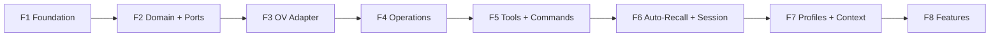

# Plano de Implementação — 8 Fases

> Rewrite do zero. Código legado em `src/_legacy/` mantido como referência.
> Cada fase funcional + testada antes de avançar.

---

## Fases

### Timeline

```
        ┌───── F1: Foundation (11d) ──────────────────────┐
        │                                                  │
        ▼                                                  │
   ┌─ F2: Domain + Ports (9d) ─────────────────────────┐  │
   │                                                     │  │
   ▼                                                     │  │
┌─ F3: OV Adapter (12d) ──────────────────────────┐     │  │
│                                                    │     │  │
▼                                                    │     │  │
┌─ F4: Operations (14d) ───────────────────────┐    │     │  │
│                                                │    │     │  │
▼                                                │    │     │  │
┌─ F5: Tools + Commands (15d) ─────────────┐    │    │     │  │
│                                            │    │    │     │  │
▼                                            │    │    │     │  │
┌─ F6: Auto-Recall + Session (15d) ─────┐   │    │    │     │  │
│                                         │   │    │    │     │  │
▼                                         │   │    │    │     │  │
┌─ F7: Profiles + Context (12d) ────┐     │   │    │    │     │  │
│                                     │     │   │    │    │     │  │
▼                                     │     │   │    │    │     │  │
┌─ F8: Features (19d) ───────────┐    │     │   │    │    │     │  │
│                                  │    │     │   │    │    │     │  │
▼                                  ▼    ▼     ▼   ▼    ▼    ▼     ▼  ▼
┌──────────────────────────────────────────────────────────────────────┐
│                        Release v1.0                                  │
└──────────────────────────────────────────────────────────────────────┘
```

### Calendário

| Fase | Início | Término | Dias | Marcos |
|------|--------|---------|------|--------|
| **F1** Foundation | 02/jun | 16/jun | 11 | Config, DI, Logger, Profiles |
| **F2** Domain + Ports | 16/jun | 26/jun | 9 | Ports definidas, EventBus |
| **F3** OV Adapter | 26/jun | 10/jul | 12 | Transport, Adapter, Mappers |
| **F4** Operations | 10/jul | 28/jul | 14 | Services, Curator, Intent Detection |
| **F5** Tools + Commands | 28/jul | 18/ago | 15 | Primeiro momento funcional |
| **F6** Auto-Recall + Session | 18/ago | 05/set | 15 | Memória persistente operacional |
| **F7** Profiles + Context | 05/set | 19/set | 12 | Profile afeta recall e actions |
| **F8** Features | 19/set | 14/out | 19 | Plugin completo + Release

---

## Detalhamento por Fase

### F1 — Foundation (11 dias)

**Objetivo:** Infraestrutura base. Nada de OV ainda. Tudo testável isoladamente.

| Tarefa | Artefato | Depende | Descrição |
|--------|----------|---------|-----------|
| F1.1 | `infrastructure/config/schema.ts` | — | Schema Zod de toda config (logger, profile, autoRecall, etc) |
| F1.2 | `infrastructure/config/cascade.ts` | F1.1 | Loader: defaults + env vars + .pi/settings.json → merge + validate |
| F1.3 | `infrastructure/config/loader.ts` | — | Leitor de .pi/settings.json |
| F1.4 | `infrastructure/di/container.ts` | — | DI container (Awilix ou implementação própria) |
| F1.5 | `infrastructure/di/modules/*.ts` | F1.4 | Módulos: core, ov, cache, intent |
| F1.6 | `adapters/driven/logger/structured.ts` | — | Logger JSON estruturado com níveis + rotação |
| F1.7 | `infrastructure/config/profile-schema.ts` | F1.1 | Schema Zod de profile + 4 builtins |
| F1.8 | `profile/manager.ts` | F1.7 | ProfileManager (getActive, apply, list, resolve) |
| — | Testes | Tudo | Cobertura ≥90% |

**Milestone:** Config carregada e validada. DI montado. Logger operacional.
Profiles registrados. Tudo testado sem OV.

### F2 — Domain + Ports (9 dias)

**Objetivo:** Núcleo do domínio puro. Sem dependência externa. Testável.

| Tarefa | Artefato | Descrição |
|--------|----------|-----------|
| F2.1 | `domain/entities/*.ts` | Value Objects: Uri, SessionId, KnowledgeItem, RecallItem, Part, etc |
| F2.2 | `domain/ports/knowledge-base.ts` | Interface KnowledgeBase |
| F2.3 | `domain/ports/session-store.ts` | Interface SessionStore |
| F2.4 | `domain/ports/fs-store.ts` | Interface FsStore |
| F2.5 | `domain/ports/event-bus.ts` | Interface EventBus + DomainEvent types |
| F2.6 | `domain/ports/cache-store.ts` | Interface CacheStore |
| F2.7 | `domain/ports/logger.ts` | Interface Logger |
| F2.8 | `domain/errors/*.ts` | Hierarquia: DomainError → NotFoundError, ConnectionError, etc |
| F2.9 | `infrastructure/event-bus/in-memory.ts` | Implementação InMemoryEventBus |
| — | Testes | Cobertura ≥90% |

**Milestone:** Domínio puro definido. Ports estabelecidas. Nada importa infra real.

### F3 — OV Adapter (12 dias)

**Objetivo:** Implementar as Ports contra o OV real. Testável com mock server.

| Tarefa | Artefato | Depende |
|--------|----------|---------|
| F3.1 | `adapters/driven/openviking/transport.ts` | F1.1 (config) |
| F3.2 | `adapters/driven/openviking/mappers/*.ts` | F2 (domain types) |
| F3.3 | `adapters/driven/openviking/adapter.ts` | F3.1 + F3.2 |
| F3.4 | Testes com mock OV (docker) | F3.3 |

**Milestone:** Ports implementadas. Testado contra OV real e mock.

### F4 — Operations (14 dias)

**Objetivo:** Casos de uso da aplicação orquestrando as Ports.

| Tarefa | Artefato | Descrição |
|--------|----------|-----------|
| F4.1 | `application/services/search.service.ts` | search + glob + grep |
| F4.2 | `application/services/write.service.ts` | save + mkdir + mv + write-back |
| F4.3 | `application/services/session.service.ts` | create + send + commit |
| F4.4 | `application/services/recall.service.ts` | orchestre search → curate → expand → inject |
| F4.5 | `domain/curator/scorers/*.ts` | relevance, temporal, lexical, preference |
| F4.6 | `domain/curator/recall-curator.ts` | Pipeline: score → rank → dedup → budget |
| F4.7 | `domain/intent/handlers/*.ts` | Continuation, ComplexQuery, SimpleQuery, LearnedRejection |
| F4.8 | `domain/intent/detector.ts` | Chain of Responsibility |

**Milestone:** Toda lógica de negócio implementada. Testada.

### F5 — Tools + Commands (15 dias)

**Objetivo:** Conectar o domínio ao Pi. Primeiro momento em que algo roda.

| Tarefa | Artefato | Descrição |
|--------|----------|-----------|
| F5.1 | `adapters/driving/pi/tool-registry.ts` | Registra 6 tools no Pi |
| F5.2 | `adapters/driving/pi/command-registry.ts` | Registra 6 commands no Pi |
| F5.3 | `adapters/driving/pi/pi-event-bridge.ts` | Traduz Pi events → EventBus |
| F5.4 | `adapters/driving/pi/status-bar.ts` | Status bar integration |
| F5.5 | `adapters/driving/tui/renderers/*.ts` | TUI renderers |
| F5.6 | `application/middleware/pipeline.ts` | Middleware Pipeline |
| F5.7 | `application/middleware/logging.ts` | Logging middleware |
| F5.8 | `application/middleware/cache.ts` | Cache middleware |
| F5.9 | `index.ts` | Entry point: init DI → connect → register |
| F5.10 | Testes integração | Testes contra Pi real |

**Milestone:** Plugin funcional. Tools e commands operacionais.

### F6 — Auto-Recall + Session Sync (15 dias)

**Objetivo:** Memória persistente funcional.

| Tarefa | Artefato |
|--------|----------|
| F6.1 | `application/services/session.service.ts` — sync engine |
| F6.2 | `application/event-handlers/session-sync.ts` |
| F6.3 | `application/event-handlers/auto-recall.ts` |
| F6.4 | `adapters/driven/openviking/health.ts` |
| F6.5 | Circuit breaker integration |

**Milestone:** Sessões sincronizadas. Memórias injetadas automaticamente.

### F7 — Profiles + Context (12 dias)

**Objetivo:** Sistema de profiles conectado a todos os consumidores.

| Tarefa | Artefato |
|--------|----------|
| F7.1 | `profile/manager.ts` — getActive + apply + list + resolve |
| F7.2 | `profile/auto-detect.ts` — minimatch rules |
| F7.3 | `domain/intent/context-profiler.ts` — session history |
| F7.4 | `adapters/driving/pi/commands/profile.ts` — /ov-profile |
| F7.5 | Integration: recall → profile.resolve() |
| F7.6 | Integration: intent → profile.forceRecall |
| F7.7 | Integration: auto-actions → profile.autoSaveMode |

**Milestone:** Profile afeta recall, intent e auto-actions.

### F8 — Features (19 dias)

**Objetivo:** Funcionalidades avançadas.

| Tarefa | Artefato |
|--------|----------|
| F8.1 | `application/services/auto-actions/` — detector + proposer + executor |
| F8.2 | `domain/curator/expand-graph.ts` — GraphExpander |
| F8.3 | Glob + Grep operations |
| F8.4 | Batch import + delete |
| F8.5 | Pack export/import operations |
| F8.6 | Watch operations |
| F8.7 | `adapters/driven/spi/mcp.ts` — MCP server export |
| F8.8 | `adapters/driven/spi/webhook.ts` — Webhook handler |
| F8.9 | E2E tests + documentation |

**Milestone:** Plugin completo. Release v1.0.

---

## Dependências entre fases



Cada fase depende da anterior. Sem atalhos. Cada fase testada antes
de iniciar a próxima.

---

## Critério de avanço entre fases

1. **Cobertura de testes ≥ 90%** na fase atual
2. **Nenhum teste falhando** (npm test = 0 failures)
3. **Todas as interfaces da fase estão estáveis** (sem mudanças quebradas)
4. **Documentação da fase está atualizada** (README do módulo)
5. **Code review aprovado** (se em time)
