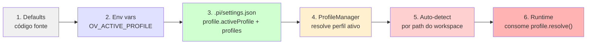
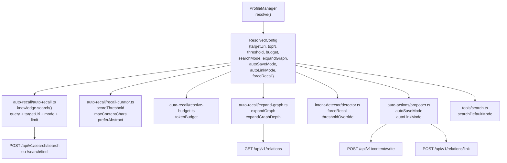

# Arquitetura do Sistema de Profiles

> **Estado:** Fase 1 (esqueleto) — schema existe com nome+descrição,
> valida no cascade, 4 builtins. Consumo real ainda não implementado.

---

## 1. Conceito

Profile é um **conjunto nomeado de parâmetros** que define como o
plugin se comporta: escopo de busca, sensibilidade do auto-recall,
nível de automação, profundidade do grafo. Funciona como uma
"receita de comportamento" que o usuário troca conforme o contexto.

```yaml
Analogia:
  Profile = "óculos de grau diferente"
  
  web-dev  = óculos de perto (foco no projeto atual)
  docs     = óculos de longe (visão ampla, sem escopo)
  learning = lupa (tudo aumenta, nada escapa)
  default  = óculos do dia a dia
```

---

## 2. Dados

### 2.1 Schema completo (proposto)

```typescript
// src/infrastructure/config/profile-schema.ts — EVOLUIR PARA

import { z } from "zod";

// ── Comportamento do auto-recall ──
const AutoRecallOverridesSchema = z.object({
  topN: z.number().min(1).max(20).optional(),
  scoreThreshold: z.number().min(0).max(1).optional(),
  tokenBudget: z.number().min(100).max(5000).optional(),
  preferAbstract: z.boolean().optional(),
  searchMode: z.enum(["auto", "fast", "deep"]).optional(),
  expandGraph: z.boolean().optional(),
  expandGraphDepth: z.number().min(0).max(5).optional(),
});

// ── Escopo ──
const ScopeSchema = z.object({
  targetUri: z.string().nullable().optional(),     // "viking://projetos/{workspace}/"
  targetUriFallback: z.boolean().optional(),       // se nada no escopo, buscar global?
});

// ── Automação ──
const AutomationSchema = z.object({
  autoSaveMode: z.enum(["off", "propose", "auto"]).optional(),
  autoLinkMode: z.enum(["off", "propose", "auto"]).optional(),
});

// ── Intent detection ──
const IntentSchema = z.object({
  thresholdOverride: z.number().min(0).max(1).optional(),   // sensibilidade do detector
  forceRecall: z.boolean().optional(),                      // sempre ativar recall
});

// ── Profile completo ──
export const ProfileConfigSchema = z.object({
  name: z.string(),
  description: z.string(),
  autoRecall: AutoRecallOverridesSchema.default({}),
  scope: ScopeSchema.default({}),
  automation: AutomationSchema.default({}),
  intent: IntentSchema.default({}),
});

export type ProfileConfig = z.infer<typeof ProfileConfigSchema>;

// ── Seção de profiles na config ──
export const ProfileSectionSchema = z.object({
  activeProfile: z.string().default("default"),
  profiles: z.record(z.string(), ProfileConfigSchema).default(BUILTIN_PROFILES),
  autoDetectRules: z.record(z.string(), z.string()).default({}),
  // autoDetectRules: { "**/web-app/**": "web-dev", "**/docs/**": "docs" }
});

export type ProfileSectionConfig = z.infer<typeof ProfileSectionSchema>;
```

### 2.2 Perfis built-in

```typescript
export const BUILTIN_PROFILES: Record<string, ProfileConfig> = {
  default: {
    name: "default",
    description: "Equilibrado — uso geral",
    autoRecall: {
      topN: 3, scoreThreshold: 0.3, tokenBudget: 500,
      preferAbstract: true, searchMode: "auto",
      expandGraph: false,
    },
    scope: { targetUri: null, targetUriFallback: false },
    automation: { autoSaveMode: "propose", autoLinkMode: "propose" },
    intent: { thresholdOverride: undefined, forceRecall: false },
  },

  "web-dev": {
    name: "web-dev",
    description: "Foco no projeto atual com contexto profundo",
    autoRecall: {
      topN: 3, scoreThreshold: 0.35, tokenBudget: 500,
      preferAbstract: true, searchMode: "deep",
      expandGraph: true, expandGraphDepth: 1,
    },
    scope: { targetUri: "viking://projetos/{workspace}/", targetUriFallback: true },
    automation: { autoSaveMode: "propose", autoLinkMode: "propose" },
    intent: { forceRecall: false },
  },

  docs: {
    name: "docs",
    description: "Busca ampla, sem escopo, sem automação",
    autoRecall: {
      topN: 5, scoreThreshold: 0.2, tokenBudget: 700,
      preferAbstract: false, searchMode: "fast",
      expandGraph: false,
    },
    scope: { targetUri: null, targetUriFallback: false },
    automation: { autoSaveMode: "off", autoLinkMode: "off" },
    intent: { forceRecall: false },
  },

  learning: {
    name: "learning",
    description: "Captura máxima — salva tudo, busca global",
    autoRecall: {
      topN: 8, scoreThreshold: 0.1, tokenBudget: 1000,
      preferAbstract: true, searchMode: "deep",
      expandGraph: true, expandGraphDepth: 2,
    },
    scope: { targetUri: null, targetUriFallback: true },
    automation: { autoSaveMode: "auto", autoLinkMode: "propose" },
    intent: { thresholdOverride: 0.3, forceRecall: true },
  },
};
```

---

## 3. Carga e Resolução

### 3.1 Pipeline de resolução



### 3.2 Código: cascade.ts (já existe, expandir)

```typescript
// src/infrastructure/config/cascade.ts — expandir

export function loadConfig(cwd: string): PiOVConfig {
  // 1-3: defaults → env → file (já existe)
  // ...

  // 4. Resolver activeProfile (pode vir de env ou file)
  const parsed = ConfigSchema.parse(config);

  // 5. Se auto-detect rules existirem, tentar match
  const detected = autoDetectProfile(cwd, parsed.profile.autoDetectRules);
  if (detected && parsed.profile.profiles[detected]) {
    parsed.profile.activeProfile = detected;
  }

  // 6. Verificar se perfil ativo existe
  if (!parsed.profile.profiles[parsed.profile.activeProfile]) {
    throw new Error(`activeProfile "${parsed.profile.activeProfile}" not found`);
  }

  return parsed;
}
```

### 3.3 ProfileManager (runtime)

```typescript
// src/profile/manager.ts — NOVO

export interface ProfileManager {
  /** Perfil atualmente ativo */
  getActive(): ProfileConfig;

  /** Lista perfis disponíveis */
  list(): { name: string; description: string }[];

  /** Trocar perfil manualmente */
  apply(name: string): void;

  /** Resolver target_uri com substituição de variáveis */
  resolveTargetUri(cwd: string): string | null;

  /** Merge das configs: base + perfil ativo */
  resolve(): ResolvedConfig;
}

export interface ResolvedConfig {
  targetUri: string | null;
  topN: number;
  scoreThreshold: number;
  tokenBudget: number;
  preferAbstract: boolean;
  searchMode: "auto" | "fast" | "deep";
  expandGraph: boolean;
  expandGraphDepth: number;
  autoSaveMode: "off" | "propose" | "auto";
  autoLinkMode: "off" | "propose" | "auto";
  forceRecall: boolean;
}
```

### 3.4 Resolução: base + profile

O profile **sobrepõe** a config base, não substitui:

```typescript
// src/profile/resolver.ts — NOVO

export function resolveConfig(
  baseConfig: PiOVConfig,
  profile: ProfileConfig,
  cwd: string,
): ResolvedConfig {
  return {
    // Escopo
    targetUri: profile.scope.targetUri
      ? profile.scope.targetUri.replace("{workspace}", extractProjectName(cwd))
      : baseConfig.autoRecall.targetUri ?? null,

    // Auto-recall: profile override > base
    topN: profile.autoRecall.topN ?? baseConfig.autoRecall.topN ?? 3,
    scoreThreshold: profile.autoRecall.scoreThreshold
      ?? baseConfig.autoRecall.scoreThreshold ?? 0.3,
    tokenBudget: profile.autoRecall.tokenBudget
      ?? baseConfig.autoRecall.tokenBudget ?? 500,
    preferAbstract: profile.autoRecall.preferAbstract
      ?? baseConfig.autoRecall.preferAbstract ?? true,
    searchMode: profile.autoRecall.searchMode
      ?? baseConfig.autoRecall.searchMode ?? "auto",
    expandGraph: profile.autoRecall.expandGraph ?? false,
    expandGraphDepth: profile.autoRecall.expandGraphDepth ?? 1,

    // Automação
    autoSaveMode: profile.automation.autoSaveMode ?? "propose",
    autoLinkMode: profile.automation.autoLinkMode ?? "propose",

    // Intent
    forceRecall: profile.intent.forceRecall ?? false,
  };
}
```

---

## 4. Pontos de Consumo (o que o profile afeta)

### 4.1 Mapa completo



### 4.2 Tabela: cada campo → endpoint OV

| Campo resolvido | Onde é lido | Endpoint OV | Parâmetro alterado |
|---|---|---|---|
| `targetUri` | `auto-recall.ts` | `POST /api/v1/search/search` | `body.target_uri` |
| `targetUri` | `tools/search.ts` (autocomplete) | `POST /api/v1/search/find` | `body.target_uri` |
| `topN` | `auto-recall.ts` | `POST /api/v1/search/*` | `body.limit` |
| `scoreThreshold` | `recall-curator.ts` | — (pós-busca, local) | threshold do filtro |
| `tokenBudget` | `resolve-budget.ts` + `auto-recall.ts` | — (local) | máx tokens injetados |
| `preferAbstract` | `auto-recall.ts` (render) | — (local) | nível do conteúdo |
| `searchMode` | `tools/search.ts` | `POST /api/v1/search/find` vs `/search` | `mode: fast | deep` |
| `expandGraph` | `auto-recall.ts` | `GET /api/v1/relations` | chama ou não expand |
| `expandGraphDepth` | `expand-graph.ts` | `GET /api/v1/relations` | profundidade da query |
| `autoSaveMode` | `auto-actions/proposer.ts` | `POST /api/v1/content/write` | chama ou não |
| `autoLinkMode` | `auto-actions/proposer.ts` | `POST /api/v1/relations/link` | chama ou não |
| `forceRecall` | `intent-detector/detector.ts` | — (decisão local) | sempre ativa recall |

### 4.3 Exemplo: fluxo completo no perfil web-dev

```
Usuário pergunta: "como otimizar a query de busca?"

1. IntentDetector analisa
   └── profile.forceRecall = false
   └── profile.thresholdOverride = undefined (usa default)
   └── categorized: complex_query, confidence: 0.8 → needsRecall: true

2. Auto-recall busca
   ├── profile.searchMode = "deep"
   ├── profile.targetUri = "viking://projetos/web-app/"
   ├── profile.topN = 3
   ├── POST /api/v1/search/search
   │   { query, target_uri, mode: "deep", limit: 3 }
   └── resultado: 3 memórias

3. Curadoria
   ├── profile.scoreThreshold = 0.35
   ├── profile.preferAbstract = true
   ├── profile.tokenBudget = 500
   ├── 1 memória descartada (score 0.2)
   ├── 2 memórias truncadas (abstract, max 500 chars)
   └── 2 injetadas (~350 tokens)

4. GraphExpander
   ├── profile.expandGraph = true
   ├── profile.expandGraphDepth = 1
   ├── GET /api/v1/relations para cada seed
   └── +1 recurso relacionado injetado (~100 tokens)

5. Auto-actions
   ├── profile.autoSaveMode = "propose"
   └── Se decisão for detectada, sugere salvar

6. Total no prompt: ~450 tokens de contexto
```

---

## 5. Auto-detect de Perfil

### 5.1 Funcionamento

```typescript
// src/profile/auto-detect.ts — NOVO

export function autoDetectProfile(
  cwd: string,
  rules: Record<string, string>,  // { "**/web-app/**": "web-dev" }
): string | null {
  for (const [pattern, profileName] of Object.entries(rules)) {
    if (minimatch(cwd, pattern)) {
      return profileName;
    }
  }
  return null;
}
```

As regras podem vir de:
1. **`.pi/settings.json`** → `profile.autoDetectRules`
2. **Built-in** → mapeamentos comuns (ver abaixo)

### 5.2 Regras built-in sugeridas

```typescript
export const BUILTIN_DETECT_RULES: Record<string, string> = {
  // Projetos web
  "**/web-app/**": "web-dev",
  "**/frontend/**": "web-dev",
  "**/mobile-app/**": "web-dev",
  // Documentação
  "**/docs/**": "docs",
  "**/wiki/**": "docs",
  "**/documentation/**": "docs",
  // Aprendizado
  "**/learning/**": "learning",
  "**/tutorial/**": "learning",
  "**/examples/**": "learning",
};
```

### 5.3 Quando o auto-detect roda

```typescript
// session_start — no bootstrap
pi.on("session_start", async (_event, ctx) => {
  const config = loadConfig(ctx.cwd);

  // Auto-detect por path
  const detected = autoDetectProfile(ctx.cwd, config.profile.autoDetectRules);
  if (detected) {
    profileManager.apply(detected);
  }
});
```

### 5.4 Prioridade vs perfil manual

```
Auto-detect roda → achou match? → aplica (sobrescreve config file)
                  → não achou? → mantém activeProfile da config
Usuário roda /ov-profile apply → sobrescreve auto-detect
Usuário roda /ov-profile apply default → volta para resolução normal
```

---

## 6. Comando `/ov-profile`

```typescript
// src/commands/profile.ts — NOVO

registerCommand(pi, deps, {
  name: "ov-profile",
  description: "Gerenciar perfis do OpenViking",

  async execute(args) {
    const subcommand = args[0];

    switch (subcommand) {
      case "apply":
        return profileManager.apply(args[1]);

      case "list":
        const profiles = profileManager.list();
        return formatProfileList(profiles);  // TUI table

      case "show":
        const active = profileManager.getActive();
        const resolved = profileManager.resolve();
        return formatProfileDetail(active, resolved);

      case "detect":
        // Forçar re-detect
        const detected = autoDetectProfile(cwd, config.profile.autoDetectRules);
        return detected
          ? `Detectado: ${detected}`
          : "Nenhum match. Usando: ${config.profile.activeProfile}";

      default:
        return "Uso: /ov-profile {apply|list|show|detect} [nome]";
    }
  },
});
```

### Exemplo de output

```bash
/ov-profile show
# → Perfil ativo: web-dev
#   ── Escopo ──
#   targetUri:      viking://projetos/web-app/
#   fallbackGlobal: true
#   ── Auto-recall ──
#   topN:           3
#   threshold:      0.35
#   budget:         500 tok
#   preferAbstract: true
#   searchMode:     deep
#   ── Grafo ──
#   expandGraph:    true
#   depth:          1
#   ── Automação ──
#   autoSave:       propose
#   autoLink:       propose
#   ── Intent ──
#   forceRecall:    false

/ov-profile list
# → default   Equilibrado — uso geral
# → web-dev   Foco no projeto atual (ativo)
# → docs      Busca ampla, sem escopo
# → learning  Captura máxima
```

---

## 7. Configuração pelo usuário

### 7.1 `.pi/settings.json`

```json
{
  "extensions": ["../src/index.ts"],
  "profile": {
    "activeProfile": "web-dev",
    "profiles": {
      "web-dev": {
        "name": "web-dev",
        "description": "Meu projeto React",
        "autoRecall": {
          "topN": 5,
          "scoreThreshold": 0.4
        },
        "scope": {
          "targetUri": "viking://projetos/meu-react-app/"
        }
      },
      "meu-perfil-custom": {
        "name": "meu-perfil-custom",
        "description": "Meu perfil customizado",
        "autoRecall": {
          "topN": 2,
          "tokenBudget": 300
        },
        "automation": {
          "autoSaveMode": "auto"
        }
      }
    },
    "autoDetectRules": {
      "**/meu-react-app/**": "web-dev",
      "**/meu-docs/**": "docs"
    }
  }
}
```

### 7.2 Env vars

```bash
export OV_ACTIVE_PROFILE=docs          # troca perfil ativo
export OV_PROFILE_WEB_DEV_TARGET_URI=...  # override específico (futuro)
```

---

## 8. Integração com IntentDetector

O profile influencia a **sensibilidade** do detector de intenção:

```typescript
// src/intent-detector/detector.ts

class IntentDetector {
  analyze(prompt: string, ctx: SessionContext): IntentProfile {
    const profile = profileManager.resolve();

    // Profile "learning" força recall SEMPRE
    if (profile.forceRecall) {
      return { needsRecall: true, confidence: 1.0, reason: "force recall (profile)" };
    }

    // Profile "docs" desliga recall para perguntas simples
    if (profile.searchMode === "fast" && prompt.split(/\s+/).length < 5) {
      return { needsRecall: false, confidence: 0.8, reason: "perfil docs + pergunta curta" };
    }

    // Threshold pode ser ajustado pelo profile
    const threshold = profile.thresholdOverride ?? this.defaultThreshold;
    // ... análise normal ...
  }
}
```

---

## 9. Estado atual vs Planejado

| Componente | Existe hoje | O que falta |
|---|---|---|
| `ProfileConfigSchema` | Só nome+descrição | Estender com autoRecall, scope, automation, intent |
| `BUILTIN_PROFILES` | 4 com nome+descrição | Adicionar parâmetros de comportamento |
| `ProfileSectionSchema` | activeProfile + profiles | Adicionar autoDetectRules |
| `loadConfig()` cascade | Valida activeProfile | Adicionar resolução de targetUri + merge |
| `ProfileManager` | ❌ | Classe com getActive, apply, list, resolve, resolveTargetUri |
| `ResolvedConfig` | ❌ | Interface com parâmetros planos |
| Auto-detect | ❌ | Função + regras built-in + integração hooks |
| `/ov-profile` command | ❌ | apply, list, show, detect |
| Consumo no auto-recall | ❌ | targetUri, topN, threshold, mode |
| Consumo no intent-detector | ❌ | thresholdOverride, forceRecall |
| Consumo nas auto-actions | ❌ | autoSaveMode, autoLinkMode |
| Consumo no expand-graph | ❌ | expandGraph, expandGraphDepth |
| Testes | ❌ | ProfileManager.test, auto-detect.test, resolver.test |

---

## 10. Árvore de Decisão do Profile

```
                    ┌────────────────────────────┐
                    │  Usuário abre Pi           │
                    │  (session_start)           │
                    └────────────┬───────────────┘
                                 │
                    ┌────────────▼───────────────┐
                    │  loadConfig(cwd)           │
                    │  profile.activeProfile = X │
                    └────────────┬───────────────┘
                                 │
                    ┌────────────▼───────────────┐
                    │  autoDetectRules match?    │
                    └────────────┬───────────────┘
                                 │
            ┌────────────────────┴────────────────────┐
            │                                         │
         SIM ┌──────────┐                          NÃO ┌──────────┐
            │ apply(detected) │                       │ mantém    │
            │ sobrescreve X   │                       │ activePro-│
            └────────┬────────┘                       │ file = X  │
                     │                                └────────┬──┘
                     └──────────────┬──────────────────────────┘
                                    │
                    ┌───────────────▼────────────────┐
                    │  ProfileManager.resolve()      │
                    │  base config + profile → merged│
                    └───────────────┬────────────────┘
                                    │
                ┌───────────────────┼───────────────────┐
                ▼                   ▼                   ▼
        ┌──────────────┐   ┌──────────────┐   ┌──────────────┐
        │  Auto-recall  │   │  IntentDet.  │   │  Auto-actions│
        │  targetUri    │   │  threshold   │   │  saveMode    │
        │  topN, mode   │   │  forceRecall │   │  linkMode    │
        │  expandGraph  │   │              │   │              │
        └──────────────┘   └──────────────┘   └──────────────┘
```
