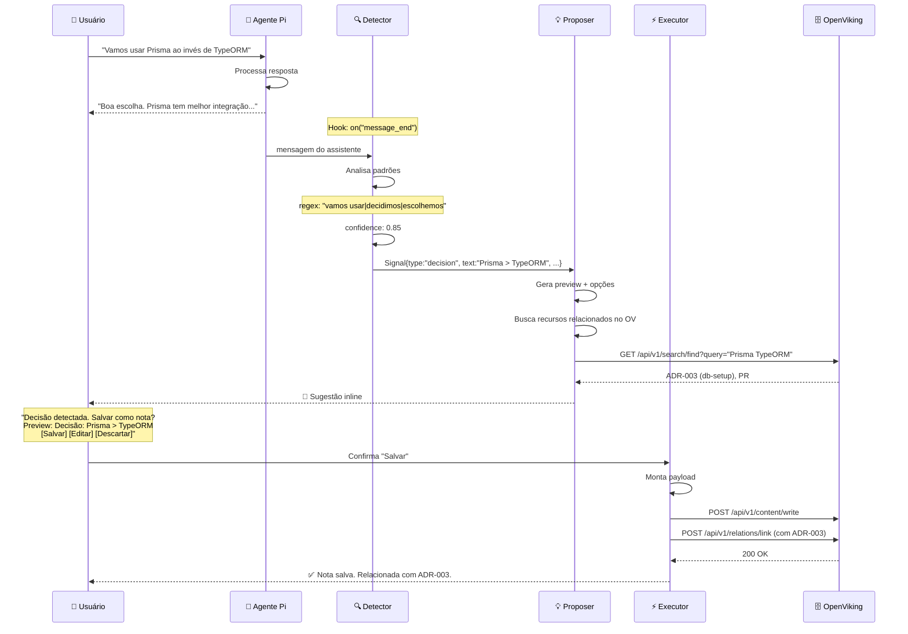
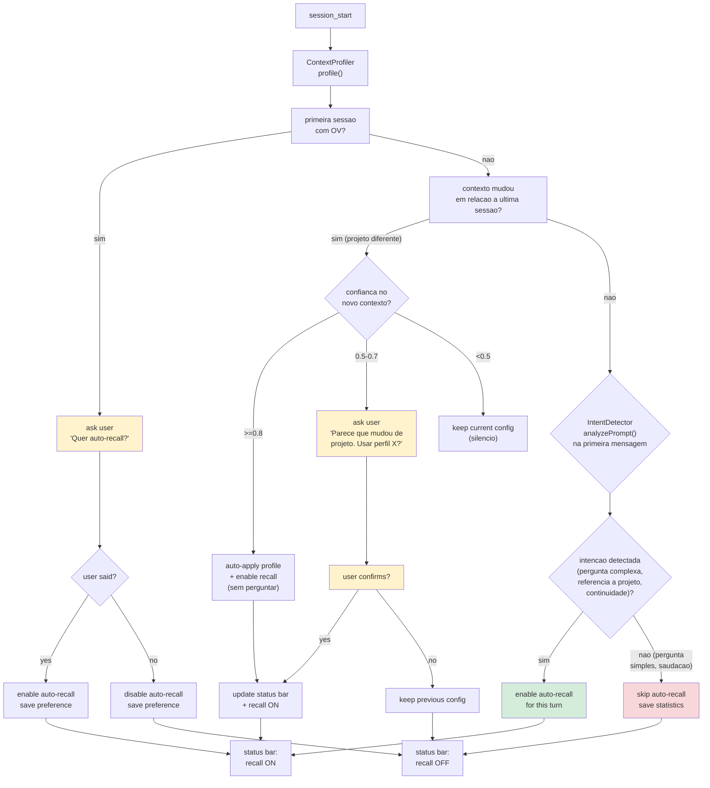
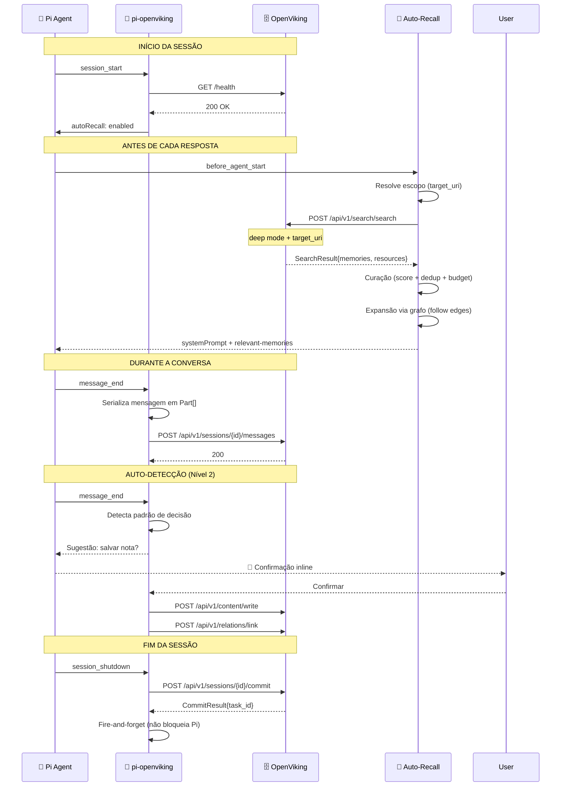
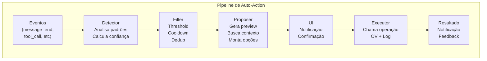
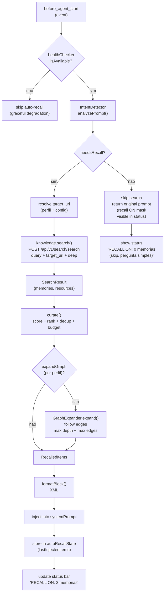
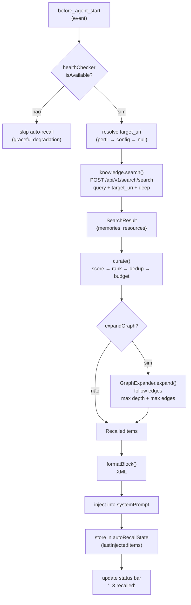
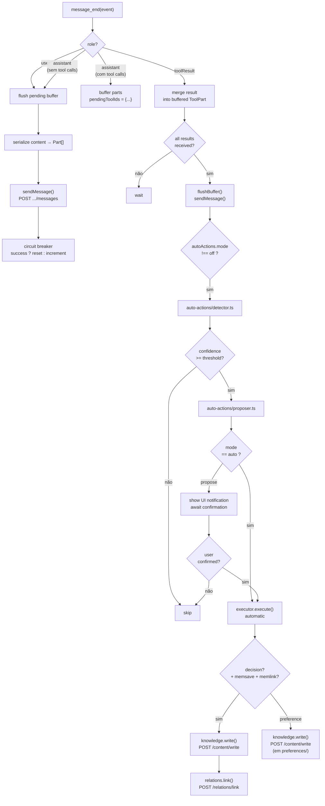
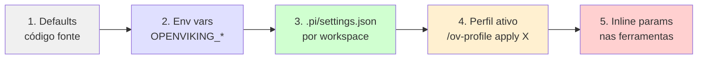
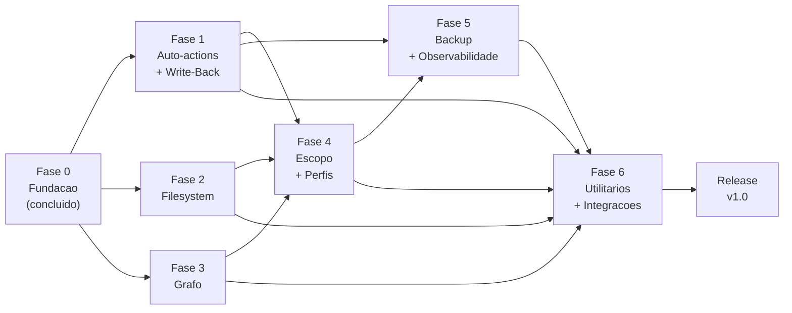

# Proposta de Arquitetura e Plano de Implementação

> **Contexto:** Documento gerado a partir da análise de gaps
> (`docs/gaps/`), manual completo hipotético (`docs/MANUAL_COMPLETO.md`)
> e proposta de auto-actions.
>
> **Objetivo:** Arquitetura definitiva para pi-openviking v1.0 — plugin
> Pi que mapeia 100% da API do OpenViking com autonomia progressiva.

---

## Índice

1. [Resumo Executivo](#1-resumo-executivo)
2. [Arquitetura de Componentes](#2-arquitetura-de-componentes)
3. [Detalhamento de Módulos](#3-detalhamento-de-módulos)
4. [Fluxos de Dados](#4-fluxos-de-dados)
5. [Plano de Implementação](#5-plano-de-implementação)
6. [Segurança, Escalabilidade e Governança](#6-segurança-escalabilidade-e-governança)
7. [Critérios de Aceitação](#7-critérios-de-aceitação)
8. [Riscos e Mitigações](#8-riscos-e-mitigações)

---

## 1. Resumo Executivo

### 1.1 Estado atual

- **18/85** endpoints OV mapeados (21%)
- **6** ferramentas MCP, **6** comandos CLI
- Auto-recall funcional mas sem escopo de projeto
- **Zero** write-back, **zero** relações, **zero** backup

### 1.2 Estado proposto

- **84/85** endpoints OV mapeados (99%)
- **18** ferramentas MCP, **22** comandos CLI
- Auto-recall com escopo por projeto + perfis
- Auto-actions (detecção → proposição → execução)
- Grafo de conhecimento completo
- Backup/restore + observabilidade

### 1.3 Princípios arquiteturais

| Princípio | Justificativa |
|-----------|---------------|
| **Layers** | Separation of concerns: transport → client → operations → tools/commands |
| **Detect → Propose → Execute** | Autonomia progressiva, nunca ação sem supervisão (nível 2) |
| **Operations first** | Toda lógica de negócio em `src/operations/`. Tools e commands são wrappers finos. |
| **Silent by default, vocal by intent** | Nunca pergunte o que pode ser inferido. Sinalize estado, não peça permissão. |
| **Ask once, learn forever** | Perguntar só na 1ª sessão ou quando padrão mudar. Depois, detectar intenção silenciosamente. |
| **Cascading config** | Default → env → settings.json → perfil → inline param |
| **Graceful degradation** | Se OV offline, plugin não quebra o Pi. Apenas desliga auto-recall. |

---

## 2. Arquitetura de Componentes

### 2.1 Diagrama de Camadas (Mermaid)

```mermaid
flowchart TB
    subgraph Presentation["🎭 Camada de Apresentação"]
        direction TB
        TUI["TUI (Terminal UI)\nRenderers + Status Bar"]
        CLI["CLI Commands\n/ov-* (22 comandos)"]
        MCP["MCP Tools\nTool API (18 ferramentas)"]
    end

    subgraph Operations["⚙️ Camada de Operações"]
        direction TB
        OPS_SEARCH["operations/search.ts\nsearchOp / globOp / grepOp"]
        OPS_READ["operations/read.ts\nreadOp"]
        OPS_BROWSE["operations/browse.ts\nbrowseOp"]
        OPS_WRITE["operations/write.ts\nwriteOp / mkdirOp / mvOp"]
        OPS_IMPORT["operations/import.ts\nimportOp / batchImportOp"]
        OPS_DELETE["operations/delete.ts\ndeleteOp / batchDeleteOp"]
        OPS_LINK["operations/link.ts\nlinkOp / unlinkOp / graphOp"]
        OPS_COMMIT["operations/commit.ts\ncommitOp"]
        OPS_PACK["operations/pack.ts\nexportOp / importPackOp / backupOp"]
        OPS_WATCH["operations/watch.ts\nwatchOp / unwatchOp"]
        OPS_DOWNLOAD["operations/download.ts\ndownloadOp"]
        OPS_REINDEX["operations/reindex.ts\nreindexOp"]
        OPS_META["operations/stats.ts\nstatsOp / observerOp"]
    end

    subgraph Client["🔌 Camada de Cliente OV"]
        direction TB
        CLIENT["ov-client/client.ts\nClientAdapters Factory"]
        TRANSPORT["ov-client/transport.ts\nHTTP Transport\nAuth + Headers + Timeout"]
        FS_OPS["ov-client/fs-ops.ts\nFsClient\nls / tree / stat / read / write / mkdir / mv"]
        SESSION_OPS["ov-client/session-ops.ts\nSessionClient\ncreate / send / commit / used"]
        KNOWLEDGE["ov-client/knowledge.ts\nKnowledgeClient\nsearch / glob / grep / link / graph\naddResource / delete / reindex / watch"]
    end

    subgraph Engine["🧠 Motor de Automação"]
        direction TB
        AUTO_RECALL["auto-recall/auto-recall.ts\nBusca → Curadoria → Injeção\n(target_uri-aware)"]
        AUTO_ACTIONS["auto-actions/\ndetector.ts → proposer.ts → executor.ts"]
        RECALL_CURATOR["auto-recall/recall-curator.ts\nScoring multi-fator\nDedup + Budget trim"]
        RESOLVE_BUDGET["auto-recall/resolve-budget.ts\nBudget adaptativo\npor % de contexto"]
        GRAPH_EXPAND["auto-recall/expand-graph.ts\nFollow edges do grafo\npara enriquecer recall"]
        INTENT_DETECTOR["intent-detector/detector.ts\nAnálise de intenção do usuário\nDecisão silenciosa de ativar recall\nAprendizado de padrões"]
        CONTEXT_PROFILER["intent-detector/context-profiler.ts\nPerfil da sessão atual\nComparação com sessões anteriores\nDetecção de mudança de contexto"]
    end

    subgraph Intent["🎯 Detecção de Intenção"]
        direction TB
        INTENT_DETECTOR["intent-detector/detector.ts\nAnalisa prompt e padrões da sessão\nDecide silenciosamente se recall é necessário\nAprende com recusas do usuário"]
        CONTEXT_PROFILER["intent-detector/context-profiler.ts\nProfiling da sessão atual\nHistórico de sessões anteriores\nDetecta mudança de projeto/contexto"]
    end

    subgraph Sync["🔄 Sincronização de Sessão"]
        direction TB
        SESSION_SYNC["session-sync/session.ts\nStreaming de mensagens\nBuffer de tool calls\nCircuit breaker"]
    end

    subgraph Infrastructure["📦 Infraestrutura"]
        direction TB
        CONFIG["shared/config.ts\nCascading config\nPerfis + Auto-detect"]
        HEALTH["shared/health.ts\nHealth check\nDegradação graciosa"]
        CACHE["autocomplete/autocomplete.ts\nviking:// autocomplete\nCache TTL 30s"]
        IMPORTER["importer/\nsource-resolver.ts\nuploader.ts\nSource → Upload → AddResource"]
        LOGGER["shared/logger.ts\nArquivo + Debug"]
        RENDER["shared/render.ts\nTUI renderers\nmemsearch / memread / generic"]
    end

    subgraph SPI["🔗 Pontos de Extensão (SPI)"]
        direction TB
        SPI_MCP["MCP Server\nExport tools para\noutros agentes"]
        SPI_WEBHOOK["Webhook Handler\nReceber callbacks\nde watches OV"]
        SPI_GIT_HOOK["Git Hook\nPre-push commit\nautomático"]
    end

    %% Connections
    Presentation --> Operations
    Operations --> Client
    Operations --> Engine
    Engine --> Client
    Sync --> Client
    Client --> TRANSPORT
    TRANSPORT -->|HTTP / API Key| OV_SERVER["OpenViking Server\n:1933"]

    Intent --> Engine

    Engine --> AUTO_RECALL
    Engine --> AUTO_ACTIONS
    AUTO_RECALL --> RECALL_CURATOR
    AUTO_RECALL --> RESOLVE_BUDGET
    AUTO_RECALL --> GRAPH_EXPAND
    AUTO_ACTIONS --> Operations

    Intent --> CONTEXT_PROFILER
    Intent --> INTENT_DETECTOR
    CONTEXT_PROFILER --> INTENT_DETECTOR

    Infrastructure --> CONFIG
    Infrastructure --> HEALTH
    Infrastructure --> CACHE
    Infrastructure --> IMPORTER
    Infrastructure --> LOGGER
    Infrastructure --> RENDER

    SPI --> Operations
    SPI --> MCP
```



### 2.2 Diagrama de Fluxo — Auto-action (Nível 2)



### 2.3 Diagrama de Fluxo — Sessão Completa

### 2.4 Diagrama de Fluxo — Inicio de Sessao com Deteccao de Intencao

Este fluxo substitui a pergunta binaria "quer auto-recall?" por uma
deteccao silenciosa de intencao. O sistema so pergunta ao usuario
em casos especificos (primeira sessao, mudanca de contexto, feedback).






---

## 3. Detalhamento de Módulos

### 3.1 Camada de Apresentação

#### Tools (MCP — agent-facing)

| Módulo | Arquivo | Ferramentas | Depende de |
|--------|---------|-------------|------------|
| Search | `tools/search.ts` | `memsearch` | operations/search |
| Read | `tools/read.ts` | `memread` | operations/read |
| Browse | `tools/browse.ts` | `membrowse` | operations/browse |
| Save | `tools/save.ts` | `memsave` | operations/write |
| Mkdir | `tools/mkdir.ts` | `memmkdir` | operations/write |
| Mv | `tools/mv.ts` | `memmv` | operations/write |
| Import | `tools/import.ts` | `memimport` (batch) | operations/import |
| Delete | `tools/delete.ts` | `memdelete` (batch) | operations/delete |
| Link | `tools/link.ts` | `memlink`, `memunlink`, `memgraph` | operations/link |
| Glob | `tools/glob.ts` | `memglob` | operations/search |
| Grep | `tools/grep.ts` | `memgrep` | operations/search |
| Commit | `tools/commit.ts` | `memcommit` | operations/commit |
| Download | `tools/download.ts` | `memdownload` | operations/download |
| Reindex | `tools/reindex.ts` | `memreindex` | operations/reindex |
| Watch | `tools/watch.ts` | `memwatch` | operations/watch |
| Pack | `tools/pack.ts` | `memexport`, `memimport-pack` | operations/pack |
| Stats | `tools/stats.ts` | `memstats` | operations/stats |

#### Commands (CLI — user-facing)

| Módulo | Comando | Equivalente tool | Descrição |
|--------|---------|-----------------|-----------|
| `commands/search.ts` | `/ov-search` | memsearch | Busca formatada |
| `commands/glob.ts` | `/ov-glob` | memglob | Busca por path |
| `commands/grep.ts` | `/ov-grep` | memgrep | Busca textual |
| `commands/browse.ts` | `/ov-ls` | membrowse | Tree view |
| `commands/read.ts` | `/ov-read` | memread | Ler recurso |
| `commands/save.ts` | `/ov-save` | memsave | Salvar nota |
| `commands/mkdir.ts` | `/ov-mkdir` | memmkdir | Criar diretório |
| `commands/mv.ts` | `/ov-mv` | memmv | Mover/renomear |
| `commands/import.ts` | `/ov-import` | memimport | Importar |
| `commands/delete.ts` | `/ov-delete` | memdelete | Deletar |
| `commands/link.ts` | `/ov-link` | memlink | Ligar recursos |
| `commands/graph.ts` | `/ov-graph` | memgraph | Ver grafo |
| `commands/commit.ts` | `/ov-commit` | memcommit | Comitar |
| `commands/recall.ts` | `/ov-recall` | — | Toggle auto-recall |
| `commands/download.ts` | `/ov-download` | memdownload | Baixar |
| `commands/reindex.ts` | `/ov-reindex` | memreindex | Reindexar |
| `commands/watch.ts` | `/ov-watch` | memwatch | Observar |
| `commands/pack.ts` | `/ov-pack-*` | memexport/import-pack | Backup |
| `commands/stats.ts` | `/ov-stats` | memstats | Estatísticas |
| `commands/status.ts` | `/ov-status` | — | Saúde servidor |
| `commands/profile.ts` | `/ov-profile` | — | Gerenciar perfis |

#### Renderers

| Módulo | Renderiza | Estratégia |
|--------|-----------|------------|
| `shared/render.ts` | memsearch, memread | Já existe. Especializado. |
| `shared/render-generic.ts` | memsave, memmkdir, memmv, ... | Template genérico (já existe) |
| `shared/render-graph.ts` | memgraph | Novo. Renderiza grafo como árvore ASCII. |
| `shared/render-stats.ts` | memstats | Novo. Tabela formatada. |
| `shared/render-glob.ts` | memglob | Novo. Lista de URIs com highlight. |

### 3.2 Camada de Operações

Cada operação encapsula lógica de negócio, validação e transformação.
Tools e commands são wrappers de 1-2 linhas que delegam para a operação.

| Módulo | Operações | Retorno | Tamanho estimado |
|--------|-----------|---------|------------------|
| `operations/write.ts` | `writeOp()`, `mkdirOp()`, `mvOp()` | `WriteResult` | ~60 linhas |
| `operations/link.ts` | `linkOp()`, `unlinkOp()`, `graphOp()` | `LinkResult` / `GraphResult` | ~80 linhas |
| `operations/search.ts` | `searchOp()`, `globOp()`, `grepOp()` | `SearchResult` (estendido) | ~50 linhas |
| `operations/pack.ts` | `exportOp()`, `importPackOp()`, `backupOp()` | `PackResult` | ~70 linhas |
| `operations/watch.ts` | `watchOp()`, `unwatchOp()`, `listWatchesOp()` | `WatchResult` | ~60 linhas |
| `operations/download.ts` | `downloadOp()` | `{content: string, filename: string}` | ~30 linhas |
| `operations/reindex.ts` | `reindexOp()` | `{task_id: string}` | ~20 linhas |
| `operations/stats.ts` | `statsOp()`, `observerOp()`, `systemOp()` | `StatsResult` | ~60 linhas |
| `operations/profile.ts` | `applyProfile()`, `listProfiles()`, `currentProfile()` | `ProfileResult` | ~50 linhas |

### 3.3 Camada de Cliente OV

#### Estado atual × Expandido

```typescript
// Estado atual — KnowledgeClient (parcial)
interface KnowledgeClient {
  search(sessionId, query, limit, mode, target_uri, signal): SearchResult;
  delete(uri, signal): { uri: string };
  verifiedDelete(uri, signal): DeleteResult;
  addResource(params, signal): { root_uri, status, errors };
  tempUpload(fileBody, filename, signal): { temp_file_id };
}

// Estado proposto — KnowledgeClient (completo)
interface KnowledgeClient {
  // Busca
  search(...): SearchResult;            // já existe
  glob(pattern, limit?, signal?): GlobResult;
  grep(pattern, regex?, caseSensitive?, uri?, signal?): GrepResult;
  
  // Conteúdo
  write(uri, content, mime?, signal?): { uri: string };
  download(uri, signal?): Buffer;
  reindex(uri, recursive?, signal?): { task_id: string };
  
  // Filesystem
  mkdir(uri, signal?): { uri: string };
  mv(from, to, signal?): { uri: string };
  
  // Relações
  link(source, target, predicate?, signal?): { ok: boolean };
  unlink(source, target, signal?): { ok: boolean };
  graph(uri, depth?, signal?): GraphResult;
  buildGraph(signal?): { task_id: string };
  
  // Watches
  addWatch(uri, webhook?, signal?): { task_id: string };
  removeWatch(taskId?, uri?, signal?): void;
  listWatches(signal?): WatchEntry[];
  triggerWatch(taskId?, uri?, signal?): void;
  
  // Observabilidade
  stats(signal?): StatsResult;
  observer(category, signal?): ObserverResult;
  system(signal?): SystemStatus;
  
  // Packs
  export(uri?, format?, signal?): { download_url: string };
  import(source_url, strategy?, signal?): { status: string };
  backup(signal?): { download_url: string };
  restore(source_url, signal?): { status: string };
}
```

#### Transport — melhoria proposta

```typescript
// src/ov-client/transport.ts — ADICIONAR

interface TransportConfig {
  endpoint: string;
  timeout: number;
  apiKey: string;
  account: string;
  user: string;
  // NOVO:
  tlsCert?: string;          // mTLS para produção
  retryMax?: number;         // 0-3 tentativas
  retryDelay?: number;       // ms entre tentativas
  rateLimit?: number;        // req/s máximo
}

interface RetryPolicy {
  maxAttempts: number;
  baseDelay: number;
  maxDelay: number;
  retryableMethods: string[]; // ["search", "read", "browse"] — NÃO "write", "delete"
  retryableStatuses: number[]; // [408, 429, 502, 503, 504]
}
```

### 3.4 Motor de Automação

#### Auto-Recall Expandido

```typescript
// src/auto-recall/auto-recall.ts — MODIFICAR

interface AutoRecallEvent {
  prompt: string;
  systemPrompt: string;
  tokenBudget?: number;
  // NOVO:
  targetUri?: string;        // escopo por projeto
  expandGraph?: boolean;     // follow edges do grafo
  preferRecent?: boolean;    // boost temporal
}

export function createAutoRecall(
  client: KnowledgeClient,
  sessionSync: SessionSyncLike,
  config: AutoRecallConfig,
  // NOVO:
  graphExpander?: GraphExpander,  // expansão via grafo
  profileResolver?: ProfileResolver, // perfil ativo
): (event: AutoRecallEvent) => Promise<RecallResult>;
```

#### GraphExpander (novo)

```typescript
// src/auto-recall/expand-graph.ts

interface GraphExpander {
  expand(
    seedItems: RecallItem[],
    depth: number,            // 0 = só seeds, 1 = 1 hop, 2 = 2 hops
    maxEdges: number,         // max edges to follow
    signal?: AbortSignal,
  ): Promise<ExpansionResult>;
}

interface ExpansionResult {
  items: RecallItem[];        // original + expanded
  edges: Edge[];              // paths followed
  trace: string[];            // "seed A → link B → found C"
}
```

Estratégia de expansão:

```
1. Seed items da busca semântica (topN ≤ 5)
2. Para cada seed, busca relations via GET /api/v1/relations
3. Filtra por predicate relevante (fundamenta, implementa, depende_de)
4. Adiciona recursos relacionados ao pool (max expandidos = 3)
5. Reranking com boost para recursos expandidos
6. Budget trim (expansão pode exceder → priorizar seeds)
```

#### Intent Detection Engine (novo módulo)

Responsável por **decidir se o auto-recall deve rodar** em cada turno,
substituindo a pergunta "quer auto-recall?" por inferência silenciosa.

```typescript
// src/intent-detector/detector.ts

type IntentCategory = "complex_query" | "continuation" | "simple_query"
                    | "greeting" | "project_reference" | "error_recovery"
                    | "file_navigation" | "code_review" | "planning";

interface IntentProfile {
  category: IntentCategory;
  confidence: number;
  needsRecall: boolean;
  needsWriteBack: boolean;
  suggestedProfile?: string;
  reason: string;
}

interface IntentDetectorConfig {
  enabled: boolean;
  learningEnabled: boolean;
  minConfidenceToRecall: number;   // 0.4
  minConfidenceToAsk: number;      // 0.7
  sessionHistoryLimit: number;     // 50
  cooldownAfterRejection: number;  // 3 sessoes
}

class IntentDetector {
  private config: IntentDetectorConfig;
  private sessionHistory: SessionProfile[];

  analyzePrompt(prompt: string, sessionProfile: SessionProfile): IntentProfile {
    const tokens = this.tokenize(prompt);
    const wordCount = tokens.length;
    const hasContinuation = this.hasContinuationMarkers(prompt);
    const hasProjectRef = this.hasProjectKeywords(prompt);
    const hasPath = this.hasProjectPath(prompt);

    // Pergunta simples
    if (wordCount < 3 && prompt.includes("?")) {
      return { category: "simple_query", confidence: 0.9, needsRecall: false,
               needsWriteBack: false, reason: "pergunta curta sem contexto" };
    }

    // Continuacao
    if (hasContinuation || this.isContinuationOfPreviousWork(prompt, sessionProfile)) {
      return { category: "continuation", confidence: 0.85, needsRecall: true,
               needsWriteBack: true, suggestedProfile: sessionProfile.lastProfile,
               reason: "continuacao de trabalho anterior" };
    }

    // Consulta complexa com path
    if (wordCount >= 8 && hasPath) {
      return { category: "complex_query", confidence: 0.8, needsRecall: true,
               needsWriteBack: false, reason: "consulta complexa com path" };
    }

    // Referencia a projeto
    if (hasProjectRef) {
      return { category: "project_reference", confidence: 0.7, needsRecall: true,
               needsWriteBack: false, reason: "referencia ao projeto" };
    }

    // Aprendizado: usuario rejeitou
    if (this.isRepeatedRejection(sessionProfile.sessionId)) {
      return { category: "simple_query", confidence: 0.5, needsRecall: false,
               needsWriteBack: false, reason: "rejeicoes previas" };
    }

    // Default conservador
    return { category: "simple_query", confidence: 0.4, needsRecall: false,
             needsWriteBack: false, reason: "sem indicadores claros" };
  }

  private hasContinuationMarkers(prompt: string): boolean {
    return /continu(a(ndo|r)|cao)|seguir|prosseguir|retomando|ainda sobre|como discutimos|conforme|como falamos|de continuidade/i.test(prompt);
  }

  private isContinuationOfPreviousWork(prompt: string, profile: SessionProfile): boolean {
    if (!profile.lastSessionSummary) return false;
    const keywords = profile.lastSessionSummary.toLowerCase().split(/\s+/).slice(0, 10);
    const matched = keywords.filter(k => prompt.toLowerCase().includes(k));
    return matched.length >= 2;
  }

  private hasProjectPath(prompt: string): boolean {
    return /(\/[a-z_][a-z0-9_]*)+(\.[a-z]+)?/i.test(prompt);
  }

  private hasProjectKeywords(prompt: string): boolean {
    return /projeto|feature|modulo|componente|servico|api|endpoint|rota|schema|model|database|deploy|build|teste|pr|pull request|issue|adr|decisao/i.test(prompt);
  }
}
```

```typescript
// src/intent-detector/context-profiler.ts

interface SessionProfile {
  sessionId: string;
  projectName: string | null;
  lastProfile: string | null;
  lastSessionSummary: string | null;
  recallEnabled: boolean;
  recallRejectedCount: number;
  turnCount: number;
  date: string;
}

class ContextProfiler {
  private sessionHistory: SessionProfile[];

  profile(cwd: string, sessionId: string): SessionProfile {
    const currentProject = this.extractProjectName(cwd);
    const lastSession = this.sessionHistory[this.sessionHistory.length - 1];
    return {
      sessionId,
      projectName: currentProject,
      lastProfile: lastSession?.lastProfile ?? null,
      lastSessionSummary: lastSession?.lastSessionSummary ?? null,
      recallEnabled: lastSession?.recallEnabled ?? true,
      recallRejectedCount: 0,
      turnCount: 0,
      date: new Date().toISOString(),
    };
  }

  detectContextChange(current: SessionProfile): ContextChange {
    const last = this.sessionHistory[this.sessionHistory.length - 1];
    if (!last) return { changed: false, confidence: 1.0, reason: "primeira sessao" };

    const projectChanged = current.projectName !== last.projectName;
    const profileChanged = current.lastProfile !== last.lastProfile;
    const timeGap = this.daysSince(last.date);

    if (projectChanged && profileChanged && timeGap > 1) {
      return { changed: true, confidence: 0.9, reason: "projeto + perfil mudaram",
               suggestedProfile: this.matchProjectToProfile(current.projectName) };
    }
    if (projectChanged) {
      return { changed: true, confidence: 0.6, reason: "projeto mudou" };
    }
    return { changed: false, confidence: 0.8, reason: "mesmo contexto" };
  }
}

interface ContextChange {
  changed: boolean;
  confidence: number;
  reason: string;
  suggestedProfile?: string;
}
```

**Diagrama de estados do IntentDetector:**

```
+--------------+     primeira sessao     +--------------+
|   UNKNOWN    |------------------------>|  ASKED_ONCE  |
| (nunca viu)  |                         |  (ja sabe)   |
+--------------+                         +------+-------+
                                                |
                        +-----------------------+-----------------------+
                        v                                               v
+----------------------------------+               +----------------------------------+
|          LEARNING                |               |          TRUSTED                  |
|  (pergunta se contexto mudar)    |---- apos N --->|  (decide sozinho sem perguntar)   |
+----------------------------------+    sessoes    +----------------------------------+
        |                                                       |
        | rejeitou 2x seguidas                                  |
        v                                                       v
+----------------------------------+
|           SILENT                 |
|  (recall off, nao pergunta mais) |
+----------------------------------+
```

#### Auto-Actions (novo módulo)



```typescript
// src/auto-actions/detector.ts

type SignalType = "decision" | "preference" | "reference" | "importable"
                   | "session_end" | "error_pattern";

interface Signal {
  id: string;                  // hash único para dedup
  type: SignalType;
  confidence: number;          // 0.0 - 1.0
  source: string;              // texto original
  extracted: string;           // texto relevante extraído
  metadata: Record<string, unknown>;
  // dados estruturados por tipo
  decision?: { subject: string; choice: string; reason: string };
  preference?: { topic: string; value: string };
  importable?: { url: string; title?: string };
}

interface DetectorConfig {
  enabled: boolean;
  mode: "off" | "propose" | "auto";
  thresholds: {
    decision: number;       // default: 0.7
    preference: number;     // default: 0.75
    reference: number;      // default: 0.6
    importable: number;     // default: 0.7
    session_end: number;    // default: 0.9
  };
  cooldowns: {
    decision: number;       // ms. default: 60_000
    preference: number;     // ms. default: 120_000
  };
}
```

```typescript
// src/auto-actions/proposer.ts

interface Proposal {
  signal: Signal;
  title: string;               // "Decisão detectada"
  preview: string;             // "Usar Prisma ao invés de TypeORM"
  actions: ProposedAction[];   // [memsave, memlink, ambos]
  dismissable: boolean;
  expireMs: number;            // 30_000 (30s para responder)
}

interface ProposedAction {
  type: "memsave" | "memimport" | "memlink" | "memcommit";
  label: string;               // "Salvar como nota"
  description: string;         // "Salva esta decisão em..."
  params: Record<string, unknown>;  // parâmetros pré-preenchidos
  destructive: boolean;        // false (ações destrutivas requerem nível 3)
  suggested: boolean;          // true (pré-selecionada)
}
```

```typescript
// src/auto-actions/executor.ts

interface ExecutorConfig {
  mode: "propose" | "auto";    // nível de autonomia
  destructiveConfirm: boolean;  // sempre confirmar delete/etc
  maxAutoActions: number;       // por sessão (default: 20)
  dryRun: boolean;              // log sem executar (debug)
}

interface ExecutionResult {
  action: ProposedAction;
  status: "executed" | "rejected" | "timeout" | "failed";
  error?: string;
  durationMs: number;
}
```

### 3.5 Sistema de Perfis

```typescript
// src/profile/ (novo módulo)

interface OVProfile {
  name: string;
  description: string;
  targetUri?: string;
  autoRecallTopN?: number;
  autoRecallScoreThreshold?: number;
  autoRecallTokenBudget?: number;
  autoRecallPreferAbstract?: boolean;
  searchDefaultMode?: "auto" | "fast" | "deep";
  autoSaveMode?: "off" | "propose" | "auto";
  autoLinkMode?: "off" | "propose" | "auto";
  expandGraph?: boolean;
  expandGraphDepth?: number;
}

class ProfileManager {
  private profiles: Map<string, OVProfile>;
  private active: string;
  private builtins: string[];  // ["default", "web-dev", "docs", "learning"]

  constructor(config: ProfileConfig);
  
  apply(name: string): void;                         // troca perfil
  getActive(): { name: string; profile: OVProfile };
  list(): { name: string; description: string }[];
  detect(cwd: string): string | null;                // auto-detect por path
  toConfig(): Partial<OpenVikingConfig>;             // gera config parcial
}
```

Perfis built-in sugeridos:

```typescript
// src/profile/builtins.ts

export const BUILTIN_PROFILES: Record<string, OVProfile> = {
  default: {
    name: "default",
    description: "Perfil padrão — equilibrado",
    autoRecallTopN: 3,
    autoRecallScoreThreshold: 0.3,
    autoRecallTokenBudget: 500,
    autoSaveMode: "propose",
    autoLinkMode: "propose",
  },
  "web-dev": {
    name: "web-dev",
    description: "Desenvolvimento web — contexto focado",
    targetUri: "viking://projetos/{workspace}/",
    autoRecallTopN: 3,
    autoRecallScoreThreshold: 0.35,
    autoRecallTokenBudget: 500,
    searchDefaultMode: "deep",
    expandGraph: true,
    expandGraphDepth: 1,
  },
  docs: {
    name: "docs",
    description: "Documentação — busca ampla",
    autoRecallTopN: 5,
    autoRecallScoreThreshold: 0.2,
    autoRecallTokenBudget: 700,
    autoRecallPreferAbstract: false,
    searchDefaultMode: "fast",
  },
  learning: {
    name: "learning",
    description: "Aprendizado — captura tudo",
    targetUri: null,  // busca global
    autoRecallTopN: 8,
    autoRecallScoreThreshold: 0.1,
    autoRecallTokenBudget: 1000,
    autoSaveMode: "auto",
    autoLinkMode: "propose",
    expandGraph: true,
    expandGraphDepth: 2,
  },
};
```

### 3.6 SPI — Service Provider Interface

```typescript
// src/spi/ (novo módulo — pontos de extensão)

// 1. MCP Server Export
export function createMCPServer(runtime: Runtime): MCPServer {
  // Exporta tools como MCP server para outros agentes consumirem
}

// 2. Webhook Handler
export function createWebhookHandler(
  onMemoryExtracted: (uri: string) => void,
  onImportComplete: (taskId: string) => void,
  onError: (taskId: string, error: string) => void,
): (req: WebhookRequest) => void;

// 3. Git Hook Integration
export function createGitHookInstaller(): {
  installPrePush(path: string): void;
  installPostCommit(path: string): void;
};

// 4. VS Code Hook
export function createVSCodeIntegration(): {
  onFileOpen(uri: string): Promise<void>;
  onFileSave(uri: string): Promise<void>;
};
```

---

## 4. Fluxos de Dados

### 4.1 Fluxo de Auto-Recall Completo (com deteccao de intencao + target_uri + grafo)

O fluxo agora comeca com a **deteccao de intencao** antes de decidir
se a busca semantica sera executada. Intencoes claras (continuacao,
referencia ao projeto) ativam recall. Perguntas simples pulam a busca.



**Regras de economia:**

```
Intencao detectada     → busca semantica normal (custo ~500 tok)
Intencao nao detectada → pula busca (custo 0 tok)
                         status mostra "skip: pergunta simples"
Usuario rejeita 3x     → detector aprende e para de ativar
Perfil "learning"      → sempre busca (ignora detector)
```

Se o auto-recall foi desligado pelo usuario (`/ov-recall off`), o
IntentDetector nao executa. Zero processamento, zero custo.



### 4.2 Fluxo de Sessão + Sync + Auto-Action



### 4.3 Fluxo de Configuração Cascading



A resolução usa `Object.assign({}, ...)` encadeado:

```typescript
function resolveConfig(sources: Partial<OVConfig>[]): OVConfig {
  return sources.reduce((acc, src) => ({ ...acc, ...src }), DEFAULT_CONFIG);
}

// Ordem:
// 1. Defaults compilados
// 2. Env vars (parseadas)
// 3. .pi/settings.json (parseado)
// 4. Perfil (resolvido por ProfileManager)
// 5. Parâmetros inline (passados na tool call)
```

---

## 5. Plano de Implementação

### 5.1 Fases e Marcos

```mermaid
gantt
    title Plano de Implementação — pi-openviking v1.0
    dateFormat  YYYY-MM-DD
    axisFormat  %b %d

    section Fase 0 — Fundação (existe)
    Documentação do estado atual           :done, 2026-05-20, 5d
    Análise de gaps (docs/gaps/)           :done, 2026-05-24, 1d

    section Fase 1 — Auto-actions + Write-Back
    Auto-actions: detector                 :active, f1a, 2026-06-01, 3d
    Auto-actions: proposer + executor      :f1b, after f1a, 3d
    Auto-actions: UI integration           :f1c, after f1b, 2d
    memsave tool + command + operation     :f1d, after f1a, 2d
    Testes Fase 1                          :f1e, after f1c, 2d

    section Fase 2 — Gerenciamento de Filesystem
    Client: write + mkdir + mv methods     :f2a, 2026-06-10, 2d
    memmkdir + memmv tools + commands      :f2b, after f2a, 2d
    Client: glob + grep methods            :f2c, after f2a, 2d
    memglob + memgrep tools + commands     :f2d, after f2c, 2d
    Testes Fase 2                          :f2e, after f2d, 2d

    section Fase 3 — Grafo de Conhecimento
    Client: link + unlink + graph methods  :f3a, 2026-06-17, 3d
    memlink + memunlink + memgraph         :f3b, after f3a, 3d
    GraphExpander (auto-recall follow)     :f3c, after f3b, 3d
    Auto-relations on memsave              :f3d, after f3b, 2d
    Testes Fase 3                          :f3e, after f3d, 2d

    section Fase 4 — Escopo + Perfis
    target_uri no auto-recall              :f4a, 2026-06-24, 2d
    ProfileManager + perfis built-in       :f4b, after f4a, 3d
    Auto-detect perfil por workspace       :f4c, after f4b, 1d
    Config tuning + documentação           :f4d, after f4c, 1d
    Testes Fase 4                          :f4e, after f4d, 2d

    section Fase 5 — Backup + Observabilidade
    Client: pack + stats + observer        :f5a, 2026-07-01, 3d
    memexport + memimport-pack tools       :f5b, after f5a, 2d
    Stats + observer tools + commands      :f5c, after f5a, 2d
    Backup automático (shutdown)           :f5d, after f5b, 1d
    Testes Fase 5                          :f5e, after f5d, 2d

    section Fase 6 — Utilitários + Integrações
    memdownload tool + command             :f6a, 2026-07-08, 1d
    memwatch tool + command                :f6b, after f6a, 2d
    memreindex tool + command              :f6c, after f6b, 1d
    Batch import + delete                  :f6d, after f6c, 2d
    SPI: MCP server export                 :f6e, 2026-07-10, 3d
    SPI: Webhook handler                   :f6f, after f6e, 2d
    Documentação completa + exemplos       :f6g, after f6f, 3d
    Testes Fase 6 + E2E                    :f6h, after f6g, 4d

    section Lançamento
    Release v1.0                           :milestone, after f6h, 0d
```

### 5.2 Detalhamento por Fase

#### Fase 0 — Fundação (✓ concluído)

| Item | Status | Artefato |
|------|--------|----------|
| Análise de gaps (12 gaps) | ✓ | `docs/gaps/` |
| Manual completo hipotético | ✓ | `docs/MANUAL_COMPLETO.md` |
| Mapa de endpoints OV | ✓ | `docs/gaps/README.md` |
| Proposta de auto-actions | ✓ | Presente neste documento |

#### Fase 1 — Auto-actions + Write-Back

| ID | Tarefa | Depende | Esforço | Artefato |
|----|--------|---------|---------|----------|
| 1.1 | Detector de padrões (decisão, preferência) | — | 3d | `src/auto-actions/detector.ts` |
| 1.2 | Proposer (gera preview, busca contexto) | 1.1 | 2d | `src/auto-actions/proposer.ts` |
| 1.3 | Executor (chama operações, log) | 1.2 | 1d | `src/auto-actions/executor.ts` |
| 1.4 | Integração UI (notificação inline) | 1.3 | 2d | `src/auto-actions/ui.ts` |
| 1.5 | Client: `write()` method | — | 0.5d | `src/ov-client/client.ts` |
| 1.6 | Operation: `writeOp()` | 1.5 | 0.5d | `src/operations/write.ts` |
| 1.7 | Tool: `memsave` + Command: `/ov-save` | 1.6 | 1d | `src/tools/save.ts`, `src/commands/save.ts` |
| 1.8 | Testes unitários + integração | 1.4, 1.7 | 2d | `tests/auto-actions.test.ts`, `tests/write-op.test.ts` |

**Milestone F1:** Auto-actions operacional (nível 2). Usuário recebe
sugestões de salvar decisões e pode confirmar com 1 clique.

#### Fase 2 — Gerenciamento de Filesystem

| ID | Tarefa | Depende | Esforço | Artefato |
|----|--------|---------|---------|----------|
| 2.1 | Client: `mkdir()`, `mv()` | — | 1d | `src/ov-client/client.ts` |
| 2.2 | Operations: `mkdirOp()`, `mvOp()` | 2.1 | 1d | `src/operations/write.ts` |
| 2.3 | Tools: `memmkdir`, `memmv` + Commands | 2.2 | 1d | `src/tools/mkdir.ts`, `mv.ts` |
| 2.4 | Client: `glob()`, `grep()` | — | 1d | `src/ov-client/client.ts` |
| 2.5 | Operations: `globOp()`, `grepOp()` | 2.4 | 0.5d | `src/operations/search.ts` |
| 2.6 | Tools: `memglob`, `memgrep` + Commands | 2.5 | 1d | `src/tools/glob.ts`, `grep.ts` |
| 2.7 | Testes | 2.3, 2.6 | 2d | — |

**Milestone F2:** Filesystem completo. Usuário organiza, renomeia,
busca por path e por texto.

#### Fase 3 — Grafo de Conhecimento

| ID | Tarefa | Depende | Esforço | Artefato |
|----|--------|---------|---------|----------|
| 3.1 | Client: `link()`, `unlink()`, `graph()` | — | 2d | `src/ov-client/client.ts` |
| 3.2 | Operations: `linkOp()`, `unlinkOp()`, `graphOp()` | 3.1 | 1d | `src/operations/link.ts` |
| 3.3 | Tools: `memlink`, `memunlink`, `memgraph` | 3.2 | 2d | `src/tools/link.ts` |
| 3.4 | GraphExpander (follow edges no auto-recall) | 3.3 | 3d | `src/auto-recall/expand-graph.ts` |
| 3.5 | Auto-relations no memsave | 3.3, F1 | 2d | `src/auto-actions/proposer.ts` |
| 3.6 | Testes | 3.4, 3.5 | 2d | — |

**Milestone F3:** Grafo operacional. Auto-recall segue arestas.
Memsave automaticamente sugere relações.

#### Fase 4 — Detecção de Intenção + Escopo + Perfis

| ID | Tarefa | Depende | Esforço | Artefato |
|----|--------|---------|---------|----------|
| 4.1 | IntentDetector: análise de prompt e classificação | — | 3d | `src/intent-detector/detector.ts` |
| 4.2 | ContextProfiler: histórico de sessões, detecção de mudança | — | 2d | `src/intent-detector/context-profiler.ts` |
| 4.3 | Integrar IntentDetector no bootstrap hooks | 4.1, 4.2, F1 | 2d | `src/bootstrap/hooks.ts` |
| 4.4 | Máquina de estados (UNKNOWN → ASKED_ONCE → LEARNING → TRUSTED/SILENT) | 4.3 | 2d | `src/intent-detector/state-machine.ts` |
| 4.5 | Aprendizado: registrar feedback do usuário e recalibrar | 4.4 | 2d | `src/intent-detector/learner.ts` |
| 4.6 | Adicionar `targetUri` ao auto-recall | — | 1d | `src/auto-recall/auto-recall.ts` |
| 4.7 | Passar `targetUri` + estado do IntentDetector no hook | 4.6 | 1d | `src/bootstrap/hooks.ts` |
| 4.8 | ProfileManager + builtins | 4.6 | 2d | `src/profile/manager.ts` |
| 4.9 | `/ov-profile` command | 4.8 | 1d | `src/commands/profile.ts` |
| 4.10 | Auto-detect de perfil por path | 4.9 | 1d | `src/profile/auto-detect.ts` |
| 4.11 | Config tuning recomendado | — | 1d | `docs/config-tuning.md` |
| 4.12 | Testes | 4.5, 4.10, 4.11 | 3d | — |

**Milestone F4:** Auto-recall com detecção de intenção. Zero perguntas
no dia a dia. Sistema aprende com recusas e se adapta automaticamente.

#### Fase 5 — Backup + Observabilidade

| ID | Tarefa | Depende | Esforço | Artefato |
|----|--------|---------|---------|----------|
| 5.1 | Client: pack methods (export, import, backup, restore) | — | 2d | `src/ov-client/client.ts` |
| 5.2 | Operations: `exportOp()`, `importPackOp()`, `backupOp()` | 5.1 | 1d | `src/operations/pack.ts` |
| 5.3 | Tools: `memexport`, `memimport-pack` | 5.2 | 1d | `src/tools/pack.ts` |
| 5.4 | Client: `stats()`, `observer()` | — | 1d | `src/ov-client/client.ts` |
| 5.5 | Operations: `statsOp()`, `observerOp()` | 5.4 | 1d | `src/operations/stats.ts` |
| 5.6 | Tools: `memstats` + Commands `/ov-stats`, `/ov-status` | 5.5 | 1d | `src/tools/stats.ts`, `src/commands/stats.ts` |
| 5.7 | Backup automático no shutdown | 5.3 | 1d | `src/bootstrap/hooks.ts` |
| 5.8 | Testes | 5.6, 5.7 | 2d | — |

**Milestone F5:** Dados protegidos. Métricas visíveis. Backup
automático no shutdown.

#### Fase 6 — Utilitários + Integrações

| ID | Tarefa | Depende | Esforço | Artefato |
|----|--------|---------|---------|----------|
| 6.1 | Client: `download()` | — | 0.5d | `src/ov-client/client.ts` |
| 6.2 | Tool: `memdownload` + Command | 6.1 | 0.5d | `src/tools/download.ts` |
| 6.3 | Client: watch methods | — | 1d | `src/ov-client/client.ts` |
| 6.4 | Operations: `watchOp()`, etc | 6.3 | 1d | `src/operations/watch.ts` |
| 6.5 | Tool: `memwatch` + Command | 6.4 | 1d | `src/tools/watch.ts` |
| 6.6 | Client: `reindex()` | — | 0.5d | `src/ov-client/client.ts` |
| 6.7 | Tool: `memreindex` + Command | 6.6 | 0.5d | `src/tools/reindex.ts` |
| 6.8 | Batch import (array de sources) | F2 | 1d | `src/tools/import.ts` |
| 6.9 | Batch delete (recursive) | F2 | 1d | `src/tools/delete.ts` |
| 6.10 | SPI: MCP server export | F1-F5 | 3d | `src/spi/mcp.ts` |
| 6.11 | SPI: Webhook handler | 6.5 | 2d | `src/spi/webhook.ts` |
| 6.12 | Documentação completa + exemplos | 6.11 | 3d | `docs/` |
| 6.13 | Testes E2E (integração completa) | 6.12 | 4d | `tests/e2e/` |

**Milestone F6:** Plugin completo. Release v1.0.

### 5.3 Mapa de Dependências entre Fases



---

## 6. Segurança, Escalabilidade e Governança

### 6.1 Segurança

#### Autenticação e Transporte

```
┌──────────┐     TLS 1.3     ┌──────────┐     mTLS       ┌──────────┐
│ Pi Agent │────────────────▶│   Proxy  │───────────────▶│ OV Server│
│ (plugin) │   X-API-Key     │ (opcional)│  X-API-Key    │ :1933    │
└──────────┘                 └──────────┘                └──────────┘
```

| Medida | Implementação | Prioridade |
|--------|---------------|------------|
| **API Key** | Header `X-API-Key` em toda requisição | Já existe |
| **Account/User isolation** | Headers `X-OpenViking-Account` + `X-OpenViking-User` | Já existe |
| **TLS** | `endpoint` configurável para `https://` | Configurável |
| **mTLS** | Suporte a certificado cliente via `tlsCert` config | Fase 6 |
| **Rate limiting** | Controle no cliente via `retryPolicy.rateLimit` | Fase 2 |
| **Retry com backoff** | `retryPolicy` com exponential backoff + jitter | Fase 2 |

#### Validação de entrada

```typescript
// Em TODAS as ferramentas e operações

// 1. Sanitização de URI
function sanitizeUri(uri: string): string {
  // Permite apenas viking://... alfanumérico + / + - + _ + .
  if (!/^viking:\/\/[a-zA-Z0-9\/\-_.]+$/.test(uri)) {
    throw new Error(`Invalid URI: ${uri}`);
  }
  // Previne path traversal
  if (uri.includes("..")) {
    throw new Error("Path traversal not allowed");
  }
  return uri;
}

// 2. Validação de content (memsave)
function validateContent(content: string): void {
  if (content.length > 1_000_000) {  // 1MB max
    throw new Error("Content exceeds 1MB limit");
  }
  // Previne injeção de comandos
}

// 3. Confirmação para ações destrutivas
async function confirmDestructive(
  ctx: ToolContext | CommandContext,
  action: string,
  target: string,
): Promise<boolean> {
  if (ctx.autoActionsLevel >= 3) return true; // autônomo
  return ctx.ui.confirm(action, target);
}
```

### 6.2 Escalabilidade

#### Estratégias

| Desafio | Solução | Fase |
|---------|---------|------|
| Múltiplos projetos | Namespaces via `target_uri` + perfis | Fase 4 |
| Muitas memórias | Curadoria com threshold + budget | Já existe |
| Sessões longas (>1k mensagens) | Circuit breaker + flush assíncrono | Já existe |
| Alto throughput de tools | Buffer de mensagens + batch send | Já existe (session-sync) |
| Cache de busca | Cache TTL para `memsearch` repetido | Fase 2 |
| Cache de filesystem | Cache TTL para `membrowse` + autocomplete | Já existe (autocomplete) |
| Rate limiting OV | Controle de concorrência (`maxConcurrent`) | Fase 2 |

#### Política de Retry

```typescript
const RETRY_POLICY: RetryPolicy = {
  maxAttempts: 2,             // tenta 1 vez extra
  baseDelay: 500,             // 500ms
  maxDelay: 5000,             // 5s
  retryableMethods: [
    "search", "read", "browse", "glob", "grep",
    "stats", "observer", "healthCheck",
  ],
  nonRetryableMethods: [
    "write", "delete", "commit", "link", "unlink",
    "import", "pack", "watch",
  ],
  retryableStatuses: [408, 429, 502, 503, 504],
};
```

#### Concorrência

```typescript
// Controle de concorrência no Transport
class RateLimitedTransport implements Transport {
  private semaphore: Semaphore;
  private queue: Request[];

  constructor(
    private inner: Transport,
    private maxConcurrent: number = 3, // default: 3 req simultâneas
    private ratePerSecond: number = 10,
  ) {
    this.semaphore = new Semaphore(maxConcurrent);
  }

  async request(...): Promise<unknown> {
    await this.semaphore.acquire();
    try {
      return await this.inner.request(...);
    } finally {
      this.semaphore.release();
    }
  }
}
```

### 6.3 Governança

#### Políticas de Dados

| Política | Descrição | Implementação |
|----------|-----------|---------------|
| **Retenção** | Quanto tempo manter memórias antigas | `pruningPolicy` no OV server |
| **Privacidade** | Categorias de privacidade por recurso | `POST /api/v1/privacy-configs/` |
| **Auditoria** | Log de todas as operações (quem, o que, quando) | `GET /api/v1/console/audit` + logs locais |
| **Consentimento** | Ações autônomas só com confirmação do usuário | Auto-actions nível 2 |
| **Isolamento** | Contas OV separadas por time/projeto | Headers `X-OpenViking-Account` |

#### Logging estruturado

```typescript
// src/shared/logger.ts — expandido

interface LogEntry {
  timestamp: string;
  level: "debug" | "info" | "warn" | "error";
  module: string;           // "auto-actions" | "session-sync" | "tools/memsave" | ...
  action: string;           // "detect_decision" | "memsave" | "health_check" | ...
  durationMs?: number;
  error?: string;
  metadata?: Record<string, unknown>;
  // Campos de auditoria
  signal?: {                // para auto-actions
    type: string;
    confidence: number;
    source: string;
  };
  confirmation?: string;    // "user_confirmed" | "user_rejected" | "auto"
}

class StructuredLogger {
  log(entry: LogEntry): void;
  query(filter: LogFilter): LogEntry[];
  export(format: "json" | "csv"): string;
}
```

#### Privacidade via OpenViking

O OV já expõe um sistema de privacidade:

```typescript
// Expondo no pi-openviking (diferido — não prioritário)
interface PrivacyClient {
  listCategories(): PrivacyCategory[];
  getConfig(category: string, target: string): PrivacyConfig;
  setConfig(category: string, target: string, config: PrivacyConfig): void;
  activateVersion(category: string, target: string, version: number): void;
}

// Uso futuro:
// /ov-privacy show memories/preferences
// /ov-privacy set memories/preferences retention:90d
```

---

## 7. Critérios de Aceitação

### 7.1 Fase 1 — Auto-actions + Write-Back

| # | Critério | Como verificar |
|---|----------|----------------|
| 1.1 | Detector identifica decisões com ≥0.7 confiança | Input "vamos usar Prisma" → Signal.type="decision", confidence≥0.7 |
| 1.2 | Detector identifica preferências com ≥0.75 confiança | Input "prefiro tabs" → Signal.type="preference", confidence≥0.75 |
| 1.3 | Detector respeita cooldown entre sugestões | Mensagens seguidas no mesmo tópico → 1 sugestão, não N |
| 1.4 | Proposer gera preview legível para decisões | "📝 Decisão: usar Prisma ao invés de TypeORM" |
| 1.5 | Proposer busca contexto relacionado no OV | Sugestão inclui ADR-003 se existir |
| 1.6 | Usuário confirma → Executor chama memsave | POST /api/v1/content/write com payload correto |
| 1.7 | Usuário rejeita → nada acontece (sem erro) | 0 chamadas OV. Log: "user_rejected" |
| 1.8 | Nível "auto" executa sem confirmação | Signal → Executor direto. Log: "auto_executed" |
| 1.9 | memsave salva conteúdo no URI especificado | POST /content/write → GET /content/read → conteúdo idêntico |
| 1.10 | memsave valida URI (rejeita path traversal) | `memsave(uri: "viking://../../etc/passwd")` → erro |

### 7.2 Fase 2 — Gerenciamento de Filesystem

| # | Critério | Como verificar |
|---|----------|----------------|
| 2.1 | memmkdir cria diretório | POST /fs/mkdir → GET /fs/ls → diretório existe |
| 2.2 | memmv move recurso | POST /fs/mv → GET /content/read no novo URI → conteúdo ok |
| 2.3 | memmv renomeia recurso | POST /fs/mv `from: "a.md"` `to: "b.md"` → b.md existe, a.md não |
| 2.4 | memglob retorna URIs por padrão | `memglob("docs/**/*.md")` → lista de .md em docs/ |
| 2.5 | memglob suporta `*`, `**`, `?` | Pattern `skills/*.md` vs `**/*.md` |
| 2.6 | memgrep encontra texto literal | `memgrep("OPENVIKING")` → recursos que contêm "OPENVIKING" |
| 2.7 | memgrep suporta regex | `memgrep(pattern: "TODO|FIXME", regex: true)` |

### 7.3 Fase 3 — Grafo de Conhecimento

| # | Critério | Como verificar |
|---|----------|----------------|
| 3.1 | memlink cria relação | POST /relations/link → GET /relations → relação aparece |
| 3.2 | memunlink remove relação | DELETE /relations/link → GET /relations → relação não aparece |
| 3.3 | memgraph retorna grafo com profundidade 1 | `memgraph(uri, depth=1)` → arestas diretas |
| 3.4 | memgraph retorna grafo com profundidade 2 | `memgraph(uri, depth=2)` → arestas + arestas das arestas |
| 3.5 | GraphExpander enriquece auto-recall | Seed A tem link para B. Auto-recall com expand=true → A + B injetados |
| 3.6 | Auto-relations no memsave sugere links | Salvar decisão sobre Prisma → sugere link com ADR-003 existente |
| 3.7 | GraphExpander respeita budget máximo | Config maxEdges=10 → no máximo 10 expandidos |

### 7.4 Fase 4 — Detecção de Intenção + Escopo + Perfis

| # | Critério | Como verificar |
|---|----------|----------------|
| 4.1 | IntentDetector classifica pergunta simples corretamente | Prompt "qual a capital?" → category="simple_query", needsRecall=false |
| 4.2 | IntentDetector detecta continuação | Prompt "continuando a feature de auth" → category="continuation", needsRecall=true |
| 4.3 | IntentDetector detecta consulta complexa | Prompt "implementar JWT em src/lib/auth.ts com refresh token" → category="complex_query", needsRecall=true |
| 4.4 | IntentDetector detecta referência ao projeto | Prompt "como o módulo de pagamento lida com webhooks" → category="project_reference", needsRecall=true |
| 4.5 | IntentDetector aprende com rejeições | Após 2 rejeições seguidas, confidence do mesmo padrão cai 0.2 |
| 4.6 | Primeira sessão pergunta 1 vez | session_start sem histórico → show confirm() dialog |
| 4.7 | Segunda sessão NÃO pergunta | session_start com histórico → silêncio, usa config anterior |
| 4.8 | Mudança de projeto com alta confiança não pergunta | projectChanged + profileChanged + timeGap > 1 → auto-apply sem confirm() |
| 4.9 | Mudança de projeto com confiança média pergunta | projectChanged mas profile igual → confirm() sugerindo troca |
| 4.10 | Máquina de estados transiciona corretamente | UNKNOWN → ASKED_ONCE (após 1ª pergunta) → LEARNING → TRUSTED ou SILENT |
| 4.11 | Status bar reflete estado do recall | recall ON mostra "RECALL ON: N" / recall OFF mostra "RECALL OFF" |
| 4.12 | Auto-recall com target_uri só busca na subárvore | target_uri="viking://proj-a/" → busca só retorna recursos de proj-a |
| 4.13 | Perfil "web-dev" aplica configurações corretas | `/ov-profile apply web-dev` → target_uri, topN, threshold mudam |
| 4.14 | Auto-detect por path funciona | Workspace em `/projetos/web-app/` → perfil "web-dev" automaticamente |
| 4.15 | `/ov-profile list` mostra perfis | Comando retorna lista nome + descrição |

### 7.5 Fase 5 — Backup + Observabilidade

| # | Critério | Como verificar |
|---|----------|----------------|
| 5.1 | memexport gera arquivo .ovpack | `memexport(uri, format="ovpack")` → download_url retornado |
| 5.2 | memimport-pack restaura dados | Export → Delete → Import → dados reaparecem |
| 5.3 | Backup automático no shutdown | Fechar sessão → POST /pack/backup chamado |
| 5.4 | `/ov-stats` mostra contagens | Total de memórias, recursos, skills, tamanho |
| 5.5 | `/ov-status` mostra saúde servidor | Conectado/desconectado + versão OV |

### 7.6 Fase 6 — Utilitários + Integrações

| # | Critério | Como verificar |
|---|----------|----------------|
| 6.1 | memdownload baixa conteúdo como arquivo | `memdownload(uri)` → arquivo no filesystem local |
| 6.2 | memwatch cria watch | POST /watches → watch listado |
| 6.3 | memreindex força reindexação | POST /content/reindex → recurso aparece em busca |
| 6.4 | Batch import aceita array de sources | `memimport(source: ["url1", "url2"])` → ambos importados |
| 6.5 | Batch delete recursivo | `memdelete(uri: "dir/", recursive: true)` → tudo deletado |
| 6.6 | MCP server exporta tools | Outro agente (ex: Claude) consegue chamar memsearch via MCP |
| 6.7 | Webhook handler recebe callback OV | OV notifica → webhook processa → evento no Pi log |
| 6.8 | 95%+ cobertura de testes | `npm test` → ≥95% lines covered |
| 6.9 | Nenhum endpoint OV sem mapeamento | Contagem manual: ≥84/85 endpoints cobertos |

### 7.7 Critérios Gerais (Todas as Fases)

| # | Critério | Como verificar |
|---|----------|----------------|
| G.1 | Plugin não quebra quando OV offline | Docker down → Pi continua funcionando, tools retornam erro amigável |
| G.2 | Plugin não bloqueia shutdown do Pi | `onShutdown()` faz 0 I/O síncrono. Tudo fire-and-forget |
| G.3 | Config cascade funciona corretamente | Default → ENV → settings.json → perfil: último vence |
| G.4 | Todas as tools têm promptGuidelines | `defineTool` inclui descrição para o agente saber quando usar |
| G.5 | Todas as tools têm TUI renderers | `renderCall` + `renderResult` implementados |
| G.6 | Logs são estruturados e auditáveis | `LogEntry` com timestamp, módulo, ação, duração |
| G.7 | Nível 2 nunca executa sem confirmação | Ação destrutiva sempre requer confirm(). Log: "user_confirmed" ou "user_rejected" |

---

## 8. Riscos e Mitigações

| Risco | Probabilidade | Impacto | Mitigação |
|-------|--------------|---------|-----------|
| OV server muda API na próxima versão | Média | Alto | Testes de integração contra OV real. Version check no health check. |
| Auto-actions geram muito ruído (falsos positivos) | Alta | Médio | Detector com threshold configurável. Cooldown. Aprendizado com recusas. |
| Grafo de conhecimento fica muito denso | Média | Baixo | GraphExpander respeita maxEdges + maxDepth. Budget trim. |
| IntentDetector classifica errado (falso positivo/negativo) | Alta | Médio | Threshold conservador (0.4). Status bar visível. Usuário override via /ov-recall. Aprendizado corrige ao longo do tempo. |
| Usuário dependente de ações autônomas perde controle | Baixa | Alto | Nível 2 como default (sempre confirma). Destrutivas sempre confirmam. |
| Aprendizado do IntentDetector cria viés | Média | Baixo | Reset periódico. Usuário limpa histórico via /ov-recall --reset-learning. |
| Performance degrade com muitas operações OV | Média | Médio | Rate limiting no Transport. Cache de busca. Circuit breaker. |
| Complexidade de configuração (muitos parâmetros) | Alta | Médio | Perfis built-in (3-5). Auto-detect por workspace. Docs claros. |
| Conflito entre auto-recall e auto-save | Baixa | Médio | Auto-recall usa apenas busca. Auto-save usa write. Não concorrem. |
| Dados sensíveis salvos sem querer | Baixa | Alto | Preview sempre mostra conteúdo antes de salvar. Confirmação obrigatória. |

---

## Apêndice A — Mapa de Novos Arquivos

```
src/
├── auto-actions/               (NOVO)
│   ├── detector.ts
│   ├── proposer.ts
│   ├── executor.ts
│   ├── ui.ts
│   └── config.ts
├── intent-detector/            (NOVO)
│   ├── detector.ts
│   ├── context-profiler.ts
│   ├── state-machine.ts
│   └── learner.ts
├── profile/                    (NOVO)
│   ├── manager.ts
│   ├── builtins.ts
│   └── auto-detect.ts
├── auto-recall/
│   └── expand-graph.ts         (NOVO)
├── operations/
│   ├── write.ts                (NOVO — memsave, mkdir, mv)
│   ├── link.ts                 (NOVO — link, unlink, graph)
│   ├── pack.ts                 (NOVO — export, import, backup)
│   ├── watch.ts                (NOVO)
│   ├── download.ts             (NOVO)
│   ├── reindex.ts              (NOVO)
│   ├── stats.ts                (NOVO)
│   └── profile.ts              (NOVO)
├── ov-client/
│   ├── knowledge.ts            (NOVO — extraído de client.ts)
│   └── client.ts               (MODIFICAR — add métodos novos)
├── tools/
│   ├── save.ts                 (NOVO)
│   ├── mkdir.ts                (NOVO)
│   ├── mv.ts                   (NOVO)
│   ├── link.ts                 (NOVO)
│   ├── glob.ts                 (NOVO)
│   ├── grep.ts                 (NOVO)
│   ├── download.ts             (NOVO)
│   ├── reindex.ts              (NOVO)
│   ├── watch.ts                (NOVO)
│   ├── pack.ts                 (NOVO)
│   ├── stats.ts                (NOVO)
│   ├── import.ts               (MODIFICAR — batch)
│   └── delete.ts               (MODIFICAR — recursive)
├── commands/
│   ├── save.ts                 (NOVO)
│   ├── mkdir.ts                (NOVO)
│   ├── mv.ts                   (NOVO)
│   ├── glob.ts                 (NOVO)
│   ├── grep.ts                 (NOVO)
│   ├── link.ts                 (NOVO)
│   ├── graph.ts                (NOVO)
│   ├── download.ts             (NOVO)
│   ├── reindex.ts              (NOVO)
│   ├── watch.ts                (NOVO)
│   ├── pack.ts                 (NOVO)
│   ├── stats.ts                (NOVO)
│   ├── status.ts               (NOVO)
│   └── profile.ts              (NOVO)
├── spi/                        (NOVO)
│   ├── mcp.ts
│   └── webhook.ts
└── shared/
    ├── render.ts               (MODIFICAR — add novos renderers)
    └── config.ts               (MODIFICAR — add novas props)

Total novos arquivos: ~38
Total modificações: ~6
```
