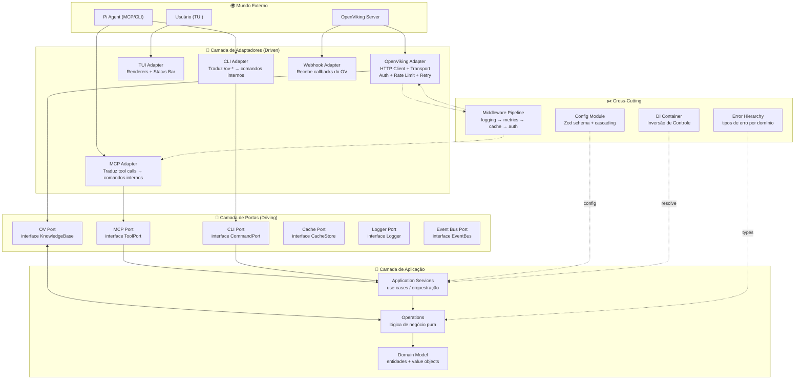
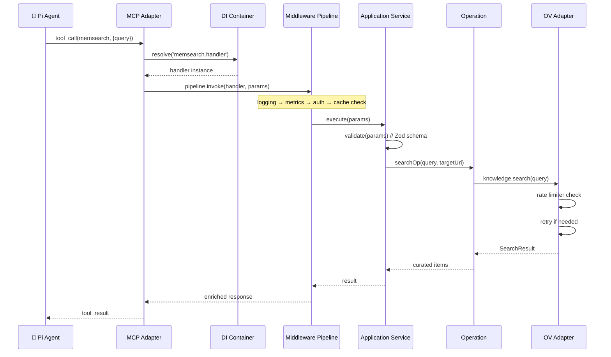

# pi-openviking Reborn: Arquitetura e Design Patterns do Zero

> Se eu pudesse reescrever o pi-openviking do zero sem carregar as
> decisões existentes, esta é a arquitetura que eu usaria.
>
> *Não é um crítica ao código atual — é um exercício de "next iteration".*

---

## 1. Diagnóstico do Design Atual

### O que já é bom (e manteria)

| Padrão | Onde | Motivo |
|--------|------|--------|
| **Operations layer** | `src/operations/*.ts` | Separa lógica de negócio da apresentação. Testável. Reutilizável. |
| **Tool/Command como thin wrappers** | `src/tools/*.ts`, `src/commands/*.ts` | Wrappers de 1-2 linhas que delegam para operations. |
| **Config cascading** | `src/shared/config.ts` | Default → env → settings.json → perfil → inline. |
| **defineTool / defineCommand** | `src/shared/tool-def.ts` | Registro declarativo com metadados. |
| **Health check + graceful degradation** | `src/shared/health.ts` | Não quebra o Pi se OV offline. |
| **Circuit breaker** | `src/session-sync/session.ts` | 3 falhas → para de tentar. |

### O que mudaria (problemas do design atual)

| Problema | Sintoma | Impacto |
|----------|---------|---------|
| **God module** | `src/ov-client/client.ts` cria `ClientAdapters` com fs, session, knowledge tudo junto | Acoplamento. Dificuldade de testar isoladamente. |
| **DI manual** | Dependências passadas como `RuntimeDeps`, mas sem container | Criação de objetos espalhada. Fácil esquecer de passar algo. |
| **Eventos do Pi como barramento** | Lógica de negócio amarrada em `pi.on("message_end", ...)` | Impossível testar sem Pi real. Acoplamento com framework. |
| **Sem tipos para erros** | `OpenVikingError` genérico | Tratamento de erro é string matching. |
| **Operações anêmicas** | `deleteOp()` é 3 linhas que só delega | Camada extra sem valor. Overhead sem abstração. |
| **Config sem schema** | Parsing manual de `cascade()` | Propriedades novas exigem código novo em 3 lugares. |
| **Zero injeção de dependência** | Tudo é `createRuntime()` → `RuntimeDeps` | Não dá para mockar middlewares, logging, cache sem modificar código. |

---

## 2. Arquitetura Proposta: Hexagonal (Ports & Adapters)

### 2.1 Diagrama de Camadas



### 2.2 Fluxo de uma Tool Call (ex: memsearch)



---

## 3. Design Patterns Essenciais

### 3.1 Ports & Adapters (Hexagonal)

```typescript
// === DOMÍNIO PURO (sem dependências externas) ===

// src/domain/ports/knowledge-base.ts
export interface KnowledgeBase {
  search(query: SearchQuery): Promise<SearchResult>;
  write(uri: string, content: Content): Promise<WriteResult>;
  searchGraph(uri: string, depth: number): Promise<GraphResult>;
  // ...sem detalhes de HTTP, sem AbortSignal, sem tipos do OV
}

export interface SearchQuery {
  text: string;
  limit: number;
  mode: SearchMode;
  scope?: UriScope;
  // Tipos do DOMÍNIO, não do OV
}

export interface SearchResult {
  items: KnowledgeItem[];
  total: number;
  queryPlan?: string;
}
```

```typescript
// === ADAPTADOR (implementa a porta) ===

// src/adapters/driven/openviking/adapter.ts
export class OpenVikingAdapter implements KnowledgeBase {
  constructor(
    private transport: Transport,
    private mapper: OVResultMapper,  // traduz JSON do OV → domínio
    private config: OVConfig,
  ) {}

  async search(query: SearchQuery): Promise<SearchResult> {
    const response = await this.transport.request(
      'POST',
      '/api/v1/search/search',
      {
        body: {
          query: query.text,
          limit: query.limit,
          target_uri: query.scope?.toString(),
        },
      },
    );
    return this.mapper.toSearchResult(response, query);
  }
}
```

### 3.2 Command Pattern (comandos e queries)

```typescript
// src/application/commands/search-knowledge.command.ts

interface SearchKnowledgeCommand {
  type: 'SEARCH_KNOWLEDGE';
  payload: {
    query: string;
    limit?: number;
    mode?: 'auto' | 'fast' | 'deep';
    uri?: string;
  };
}

interface SearchKnowledgeResult {
  items: KnowledgeItem[];
  total: number;
  durationMs: number;
}

class SearchKnowledgeHandler implements CommandHandler<SearchKnowledgeCommand, SearchKnowledgeResult> {
  constructor(
    private knowledge: KnowledgeBase,
    private curator: RecallCurator,
    private intentDetector: IntentDetector,
    private metrics: MetricsCollector,
  ) {}

  async execute(cmd: SearchKnowledgeCommand): Promise<SearchKnowledgeResult> {
    const start = Date.now();
    
    // 1. Intent detection
    const intent = this.intentDetector.analyze(cmd.payload.query);
    if (!intent.needsRecall) {
      return { items: [], total: 0, durationMs: 0 };
    }

    // 2. Search
    const results = await this.knowledge.search({
      text: cmd.payload.query,
      limit: cmd.payload.limit ?? 10,
      mode: cmd.payload.mode ?? 'auto',
      scope: cmd.payload.uri ? new UriScope(cmd.payload.uri) : undefined,
    });

    // 3. Curate
    const curated = this.curator.curate(results, cmd.payload.query);

    // 4. Metrics
    this.metrics.record('search', Date.now() - start, curated.length);
    
    return { items: curated, total: results.total, durationMs: Date.now() - start };
  }
}
```

### 3.3 Middleware Pipeline

```typescript
// src/application/middleware/pipeline.ts

interface Middleware<T> {
  handle(context: T, next: () => Promise<T>): Promise<T>;
}

class Pipeline<T> {
  private middlewares: Middleware<T>[] = [];

  use(mw: Middleware<T>): void {
    this.middlewares.push(mw);
  }

  async execute(initial: T, handler: (ctx: T) => Promise<T>): Promise<T> {
    // Monta a chain: mw1 → mw2 → mw3 → handler
    const chain = this.middlewares.reduceRight(
      (next, mw) => async (ctx: T) => mw.handle(ctx, () => next(ctx)),
      handler,
    );
    return chain(initial);
  }
}
```

```typescript
// Middlewares concretos

class LoggingMiddleware implements Middleware<CommandContext> {
  constructor(private logger: StructuredLogger) {}

  async handle(ctx: CommandContext, next: () => Promise<CommandContext>): Promise<CommandContext> {
    const start = Date.now();
    this.logger.info(`→ ${ctx.command}`, { params: ctx.params });
    
    try {
      const result = await next();
      this.logger.info(`← ${ctx.command}`, { durationMs: Date.now() - start });
      return result;
    } catch (err) {
      this.logger.error(`✗ ${ctx.command}`, { durationMs: Date.now() - start, error: err.message });
      throw err;
    }
  }
}

class CacheMiddleware implements Middleware<CommandContext> {
  constructor(private cache: CacheStore) {}

  async handle(ctx: CommandContext, next: () => Promise<CommandContext>): Promise<CommandContext> {
    // Só cachear buscas GET-like
    if (!['memsearch', 'memread', 'membrowse', 'memglob', 'memgrep'].includes(ctx.command)) {
      return next();
    }

    const cacheKey = `${ctx.command}:${JSON.stringify(ctx.params)}`;
    const cached = await this.cache.get(cacheKey);
    if (cached) {
      return { ...ctx, result: cached };
    }

    const result = await next();
    await this.cache.set(cacheKey, result, { ttl: 30_000 });
    return result;
  }
}

class MetricsMiddleware implements Middleware<CommandContext> {
  constructor(private metrics: MetricsCollector) {}

  async handle(ctx: CommandContext, next: () => Promise<CommandContext>): Promise<CommandContext> {
    const start = Date.now();
    const result = await next();
    this.metrics.timing(ctx.command, Date.now() - start);
    this.metrics.increment(`${ctx.command}.calls`);
    return result;
  }
}
```

### 3.4 Chain of Responsibility (Intent Detection)

```typescript
// src/domain/intent/intent-handler.ts

interface IntentHandler {
  analyze(prompt: string, context: SessionContext): IntentResult | null;
  setNext(handler: IntentHandler): IntentHandler;
}

abstract class BaseIntentHandler implements IntentHandler {
  private next: IntentHandler | null = null;

  setNext(handler: IntentHandler): IntentHandler {
    this.next = handler;
    return handler;
  }

  async analyze(prompt: string, context: SessionContext): Promise<IntentResult> {
    const result = this.handle(prompt, context);
    if (result && result.confidence >= this.threshold()) {
      return result;
    }
    if (this.next) return this.next.analyze(prompt, context);
    return { needsRecall: false, confidence: 0, reason: 'no handler matched' };
  }

  protected abstract handle(prompt: string, context: SessionContext): IntentResult | null;
  protected abstract threshold(): number;
}
```

```typescript
// src/domain/intent/handlers/

class ContinuationHandler extends BaseIntentHandler {
  protected threshold() { return 0.7; }

  protected handle(prompt: string, ctx: SessionContext): IntentResult | null {
    const patterns = [
      /continu(a(ndo|r)|ção)/i,
      /dando sequência/i,
      /retomando/i,
      /ainda sobre/i,
      /como discutimos/i,
      /dê continuidade/i,
    ];
    if (patterns.some(p => p.test(prompt))) {
      return {
        needsRecall: true,
        confidence: 0.85,
        reason: 'continuação de trabalho anterior',
        suggestedProfile: ctx.lastProfile,
      };
    }
    return null;
  }
}

class ComplexQueryHandler extends BaseIntentHandler {
  protected threshold() { return 0.7; }

  protected handle(prompt: string, ctx: SessionContext): IntentResult | null {
    const tokens = prompt.split(/\s+/);
    const hasPath = /(\/[a-z_][a-z0-9_]*)+(\.[a-z]+)?/i.test(prompt);
    const isLong = tokens.length >= 8;
    const hasProjectTerms = /feature|módulo|componente|serviço|api|rota|schema|model|database|deploy/i.test(prompt);

    if (isLong && (hasPath || hasProjectTerms)) {
      return {
        needsRecall: true,
        confidence: 0.8,
        reason: 'consulta complexa com referências técnicas',
      };
    }
    return null;
  }
}

class SimpleQueryHandler extends BaseIntentHandler {
  protected threshold() { return 0.8; }

  protected handle(prompt: string, ctx: SessionContext): IntentResult | null {
    const tokens = prompt.split(/\s+/);
    if (tokens.length < 4 && prompt.includes('?')) {
      return {
        needsRecall: false,
        confidence: 0.9,
        reason: 'pergunta curta, sem contexto de projeto',
      };
    }
    return null;
  }
}

class LearnedRejectionHandler extends BaseIntentHandler {
  protected threshold() { return 0.5; }

  constructor(private history: SessionHistory) { super(); }

  protected handle(prompt: string, ctx: SessionContext): IntentResult | null {
    const recentRejections = this.history.getRecentRejections(ctx.sessionId, 3);
    if (recentRejections >= 2) {
      return {
        needsRecall: false,
        confidence: 0.6,
        reason: `usuário rejeitou recall ${recentRejections}x seguidas`,
      };
    }
    return null;
  }
}

// Uso:
const chain = new ContinuationHandler();
chain
  .setNext(new ComplexQueryHandler())
  .setNext(new SimpleQueryHandler())
  .setNext(new LearnedRejectionHandler(history));

const intent = await chain.analyze(prompt, sessionContext);
```

### 3.5 Event Bus (desacopla Pi Events do domínio)

```typescript
// src/domain/ports/event-bus.ts

type DomainEvent =
  | { type: 'SESSION_STARTED'; sessionId: string; cwd: string }
  | { type: 'SESSION_ENDED'; sessionId: string }
  | { type: 'MESSAGE_PROCESSED'; sessionId: string; role: string }
  | { type: 'MEMORY_SAVED'; uri: string; contentLength: number }
  | { type: 'INTENT_DETECTED'; category: string; confidence: number }
  | { type: 'RELATION_CREATED'; source: string; target: string; predicate: string }
  | { type: 'RECALL_EXECUTED'; itemsCount: number; durationMs: number }
  | { type: 'ERROR'; source: string; error: string };

interface EventBus {
  publish(event: DomainEvent): void;
  subscribe<T extends DomainEvent>(type: T['type'], handler: (event: T) => void): () => void; // returns unsubscribe
}

// src/infrastructure/event-bus/in-memory-bus.ts
class InMemoryEventBus implements EventBus {
  private handlers = new Map<string, Set<Function>>();

  publish(event: DomainEvent): void {
    const handlers = this.handlers.get(event.type);
    if (!handlers) return;
    for (const handler of handlers) {
      try { handler(event); } catch { /* nunca quebrar o fluxo principal */ }
    }
  }

  subscribe(type: string, handler: Function): () => void {
    if (!this.handlers.has(type)) this.handlers.set(type, new Set());
    this.handlers.get(type)!.add(handler);
    return () => this.handlers.get(type)?.delete(handler);
  }
}
```

```typescript
// Adaptador que conecta Pi events → Domain Event Bus

// src/adapters/driving/pi/pi-event-bridge.ts
export class PiEventBridge {
  constructor(
    private pi: ExtensionAPI,
    private bus: EventBus,
  ) {
    // Ponte: Pi event → Domain Event
    pi.on('session_start', (event, ctx) => {
      this.bus.publish({
        type: 'SESSION_STARTED',
        sessionId: ctx.sessionId,
        cwd: ctx.cwd,
      });
    });

    pi.on('message_end', (event) => {
      this.bus.publish({
        type: 'MESSAGE_PROCESSED',
        sessionId: event.sessionId,
        role: event.message.role,
      });
    });
  }
}
```

```typescript
// Handler que reage a eventos do domínio

// src/application/event-handlers/auto-save-on-decision.ts
export class AutoSaveOnDecisionHandler {
  constructor(
    private bus: EventBus,
    private knowledge: KnowledgeBase,
    private detector: IntentDetector,
  ) {
    this.bus.subscribe('MESSAGE_PROCESSED', this.onMessage.bind(this));
  }

  private async onMessage(event: MESSAGE_PROCESSED): Promise<void> {
    if (event.role !== 'assistant') return;
    const signal = this.detector.detectDecision(event.text);
    if (!signal) return;

    this.bus.publish({
      type: 'INTENT_DETECTED',
      category: 'decision',
      confidence: signal.confidence,
    });
  }
}
```

### 3.6 Type-safe Config com Zod

```typescript
// src/infrastructure/config/schema.ts
import { z } from 'zod';

const AutoRecallConfigSchema = z.object({
  enabled: z.boolean().default(true),
  topN: z.number().min(1).max(20).default(3),
  tokenBudget: z.number().min(100).max(5000).default(500),
  scoreThreshold: z.number().min(0).max(1).default(0.3),
  preferAbstract: z.boolean().default(true),
  maxContentChars: z.number().min(100).max(5000).default(400),
  timeout: z.number().min(1000).max(60000).default(5000),
  targetUri: z.string().optional(),
  expandGraph: z.boolean().default(false),
  expandGraphDepth: z.number().min(1).max(5).default(1),
});

const ProfileSchema = z.object({
  name: z.string().min(1),
  description: z.string(),
  autoRecall: AutoRecallConfigSchema.partial(),
  autoSaveMode: z.enum(['off', 'propose', 'auto']).default('propose'),
  autoLinkMode: z.enum(['off', 'propose', 'auto']).default('propose'),
  searchDefaultMode: z.enum(['auto', 'fast', 'deep']).default('auto'),
});

const OVConfigSchema = z.object({
  endpoint: z.string().url().default('http://localhost:1933'),
  apiKey: z.string().default('dev'),
  account: z.string().default('default'),
  user: z.string().default('default'),
  timeout: z.number().default(30000),
  commitTimeout: z.number().default(60000),
  healthPath: z.string().default('/health'),
  tlsCert: z.string().optional(),
  retryMax: z.number().min(0).max(5).default(2),
  retryDelay: z.number().default(500),
  rateLimit: z.number().default(10),
  autoRecall: AutoRecallConfigSchema.default({}),
  profiles: z.record(ProfileSchema).optional(),
  activeProfile: z.string().optional(),
  autoDetectProfile: z.record(z.string()).optional(),
});

export type OVConfig = z.infer<typeof OVConfigSchema>;

// Resolução cascading type-safe
export function loadConfig(cwd: string): OVConfig {
  const envConfig = {
    endpoint: process.env.OPENVIKING_ENDPOINT,
    apiKey: process.env.OPENVIKING_API_KEY,
    // ...mapear todas as env vars
  };

  const fileConfig = readJsonSafe(join(cwd, '.pi', 'settings.json'));

  // Zod faz merge + validação + defaults em UM lugar
  return OVConfigSchema.parse({
    ...fileConfig,
    ...envConfig,  // env sobrescreve file
  });
}
```

---

## 4. Estrutura de Diretórios (Reborn)

```
src/
├── domain/                          # REGRAS DE NEGÓCIO PURAS
│   ├── entities/
│   │   ├── knowledge-item.ts        # Value Object
│   │   ├── recall-item.ts           # Entity
│   │   ├── session.ts               # Aggregate
│   │   └── relation.ts              # Value Object
│   ├── ports/                       # Interfaces (contractos)
│   │   ├── knowledge-base.ts        # Porta de saída (OV)
│   │   ├── cache-store.ts           # Porta de saída (cache)
│   │   ├── event-bus.ts             # Porta de entrada/saída
│   │   ├── logger.ts                # Porta de saída (log)
│   │   └── config-provider.ts       # Porta de saída (config)
│   ├── intent/                      # Chain of Responsibility
│   │   ├── intent-handler.ts        # Handler abstrato
│   │   ├── handlers/
│   │   │   ├── continuation.ts      # Continuação de trabalho
│   │   │   ├── complex-query.ts     # Consulta técnica
│   │   │   ├── simple-query.ts      # Pergunta curta
│   │   │   └── learned-rejection.ts # Aprendizado com recusas
│   │   └── types.ts
│   └── errors/                      # Hierarquia de erros
│       ├── base.ts                  # DomainError
│       ├── not-found.ts             # ResourceNotFoundError
│       ├── validation.ts            # ValidationError
│       ├── connection.ts            # ConnectionError
│       └── auth.ts                  # AuthError
│
├── application/                     # CASOS DE USO
│   ├── services/
│   │   ├── search.service.ts        # Orquestra busca + curadoria
│   │   ├── write.service.ts         # Orquestra save + link + reindex
│   │   ├── session.service.ts       # Gerencia ciclo de vida da sessão
│   │   ├── recall.service.ts        # Auto-recall + GraphExpander
│   │   └── backup.service.ts        # Pack export/import
│   ├── commands/                    # Command Handlers
│   │   ├── search-knowledge.ts
│   │   ├── save-knowledge.ts
│   │   ├── commit-session.ts
│   │   └── ...
│   ├── middleware/                  # Pipeline interceptors
│   │   ├── pipeline.ts
│   │   ├── logging.middleware.ts
│   │   ├── cache.middleware.ts
│   │   ├── metrics.middleware.ts
│   │   └── rate-limit.middleware.ts
│   ├── event-handlers/             # Reage a Domain Events
│   │   ├── auto-save-on-decision.ts
│   │   ├── auto-commit-on-shutdown.ts
│   │   ├── update-status-bar.ts
│   │   └── record-metrics.ts
│   └── curator/                    # Curadoria de recall
│       ├── recall-curator.ts
│       ├── scorers/
│       │   ├── base.ts
│       │   ├── relevance.ts
│       │   ├── temporal.ts
│       │   ├── lexical.ts
│       │   └── preference.ts
│       └── dedup-strategy.ts
│
├── adapters/                        # IMPLEMENTAÇÕES CONCRETAS
│   ├── driving/                     # Adaptadores que ENTRAM no app
│   │   ├── pi/
│   │   │   ├── tool.registry.ts     # Registra tools no Pi
│   │   │   ├── command.registry.ts  # Registra commands no Pi
│   │   │   ├── pi-event-bridge.ts   # Traduz Pi → Domain Events
│   │   │   └── status-bar.ts        # Status bar do Pi
│   │   ├── cli/
│   │   │   └── command.parser.ts    # Parse de /ov-* args
│   │   └── tui/
│   │       ├── renderers/
│   │       │   ├── search.ts
│   │       │   ├── graph.ts
│   │       │   └── generic.ts
│   │       └── theme.ts
│   └── driven/                      # Adaptadores que SAEM do app
│       ├── openviking/
│       │   ├── adapter.ts           # Implementa KnowledgeBase
│       │   ├── transport.ts         # HTTP + rate limit + retry
│       │   ├── mappers/             # Traduz JSON do OV → Domain
│       │   │   ├── search.ts
│       │   │   ├── content.ts
│       │   │   └── graph.ts
│       │   └── errors.ts            # HTTP status → DomainError
│       ├── cache/
│       │   ├── in-memory.ts         # Cache em Map com TTL
│       │   └── redis.ts             # Cache Redis (opcional)
│       ├── config/
│       │   ├── file-loader.ts       # Lê .pi/settings.json
│       │   ├── env-loader.ts        # Lê OPENVIKING_*
│       │   └── zod-schema.ts        # Schema de validação
│       └── logger/
│           ├── structured.ts        # Logger JSON estruturado
│           └── console.ts           # Logger para debug
│
├── infrastructure/                  # INFRA (DI, config, setup)
│   ├── di/
│   │   ├── container.ts            # DI Container (Awilix ou simples)
│   │   ├── modules/
│   │   │   ├── core.module.ts      # Services + Operations
│   │   │   ├── ov.module.ts        # OV Adapter
│   │   │   ├── cache.module.ts     # Cache
│   │   │   └── intent.module.ts    # Intent Detection chain
│   │   └── tokens.ts              # Injeção por string token
│   ├── config/
│   │   └── config.module.ts       # Load + validate + provide
│   └── lifecycle.ts               # start → ready → shutdown
│
├── index.ts                        # Entry point: DI init + register
└── bootstrap.ts                    # Legacy bridge (se necessário)
```

---

## 5. DI Container + Inicialização

```typescript
// src/infrastructure/di/container.ts

import { createContainer, asClass, asFunction, asValue, type AwilixContainer } from 'awilix';

// Ou implementação própria mínima (~40 linhas)

export interface DIContainer {
  resolve<T>(token: string): T;
  register(token: string, factory: () => unknown, singleton?: boolean): void;
}

// src/index.ts — Entry point
export default async function openVikingExtension(pi: ExtensionAPI) {
  // 1. Config
  const config = loadConfig(pi.cwd);

  // 2. DI Container
  const container = new DIContainer();

  // 3. Register adapters
  container.register('config', () => config, true);
  container.register('logger', () => new StructuredLogger(config), true);
  container.register('eventBus', () => new InMemoryEventBus(), true);
  container.register('cache', () => new InMemoryCache({ ttl: 30_000 }), true);
  container.register('transport', () => createTransport(config), true);
  container.register('knowledge', () => new OpenVikingAdapter(
    container.resolve('transport'),
    new OVResultMapper(),
    config,
  ), true);

  // 4. Register Intent Detection Chain
  container.register('intentDetector', () => {
    const chain = new ContinuationHandler();
    chain
      .setNext(new ComplexQueryHandler())
      .setNext(new SimpleQueryHandler())
      .setNext(new LearnedRejectionHandler(container.resolve('history')));
    return chain;
  }, true);

  // 5. Register Services
  container.register('searchService', () => new SearchKnowledgeHandler(
    container.resolve('knowledge'),
    container.resolve('curator'),
    container.resolve('intentDetector'),
    container.resolve('metrics'),
  ), true);

  // 6. Pipeline com middlewares
  const pipeline = new Pipeline<CommandContext>();
  pipeline.use(new LoggingMiddleware(container.resolve('logger')));
  pipeline.use(new CacheMiddleware(container.resolve('cache')));
  pipeline.use(new MetricsMiddleware(container.resolve('metrics')));

  // 7. Bridge Pi Events → Domain Events
  const bridge = new PiEventBridge(pi, container.resolve('eventBus'));
  bridge.connect();

  // 8. Register Event Handlers
  new AutoSaveOnDecisionHandler(
    container.resolve('eventBus'),
    container.resolve('knowledge'),
    container.resolve('intentDetector'),
  );

  // 9. Register Tools + Commands via Registry
  const toolRegistry = new ToolRegistry(pi, container, pipeline);
  toolRegistry.registerAll(); // lê de tools/registry.ts

  const commandRegistry = new CommandRegistry(pi, container);
  commandRegistry.registerAll(); // lê de commands/registry.ts
}
```

---

## 6. Comparação: Antes vs Depois

| Aspecto | Código Atual | Reborn |
|---------|-------------|--------|
| **Acoplamento** | Tools chamam operations via RuntimeDeps | Tools chamam serviços via DI container |
| **Testabilidade** | Mockar Pi events é difícil | Domain puro: sem dependência externa. Adapters mockáveis por interface. |
| **Tipos de erro** | `OpenVikingError` genérico | Hierarquia: `NotFoundError`, `ConnectionError`, `ValidationError`, `AuthError` |
| **Config** | `cascade()` manual, sem schema | Zod schema: validação + defaults + inferência de tipos automática |
| **Eventos** | `pi.on(...)` em 4 lugares diferentes | `EventBus` centralizado. Handlers registrados por módulo. |
| **Cache** | Só autocomplete (30s TTL) | Middleware de cache configurável por comando |
| **Intent Detection** | Não existe (só `/ov-recall` toggle) | Chain of Responsibility com aprendizado |
| **Cross-cutting** | Log/error espalhados | Pipeline de middlewares |
| **Transport** | Fetch direto com timeout | Retry + rate limit + circuit breaker + métricas |
| **Domain model** | Tipos do OV vazam para tools | Tipos do domínio puro. Mappers isolam o OV. |

---

## 7. Quando valeria a pena reescrever?

A arquitetura atual **funciona** e entrega valor. Não recomendo
reescrever do zero agora. Mas **se** algum dia:

1. Precisar suportar múltiplos backends (não só OV → Mem0, SQLite, etc.)
2. Precisar expor como SDK para outros agentes (não só Pi)
3. Precisar de testes unitários sem mockar Pi inteiro
4. A base de código crescer além de ~5k linhas

**Aí sim** vale migrar para esta arquitetura hexagonal.
Até lá, o design atual é bom o suficiente — e a dívida técnica
está documentada para quem quiser refatorar.
